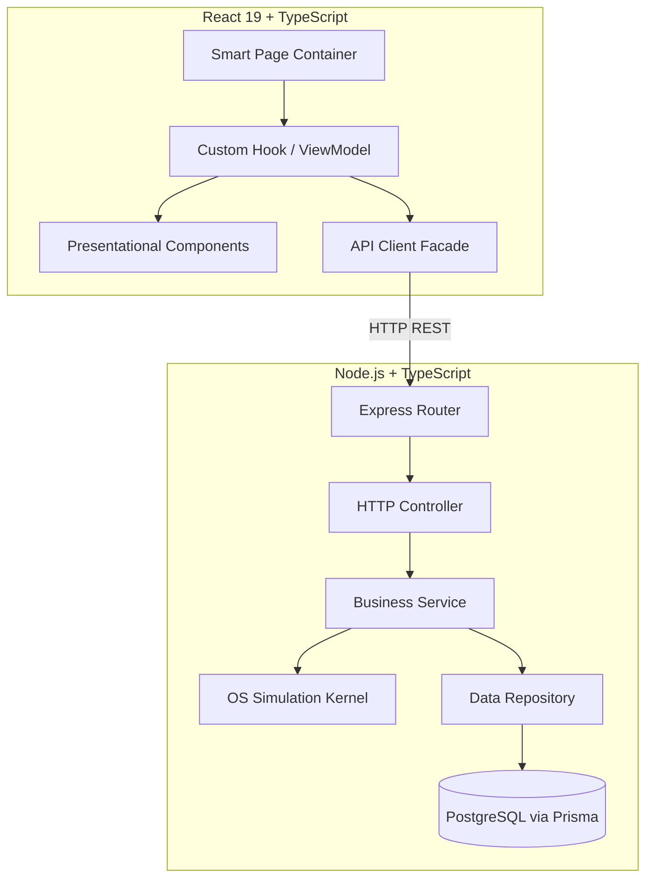
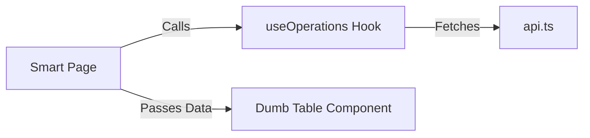
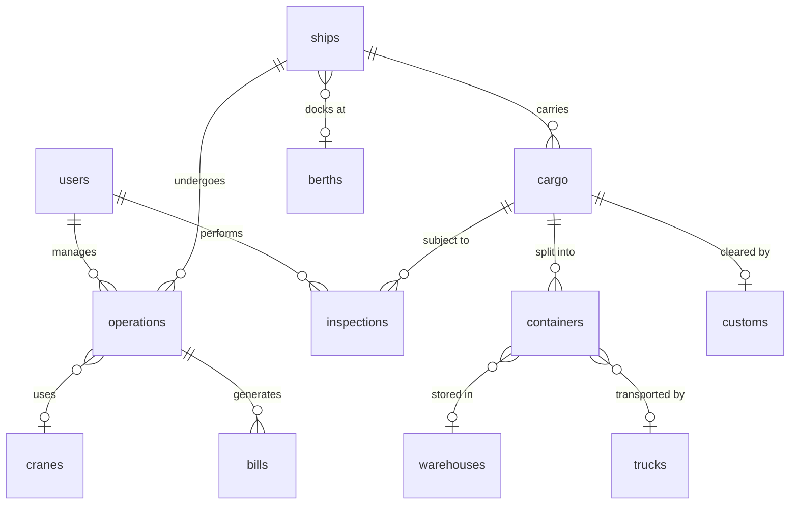

<div align="center">
  <h1>🏛️ PortFlow — Low-Level Design (LLD)</h1>
  <p><strong>Software Architecture & Engineering Principles</strong></p>
</div>

---

## 1. Architectural Overview & Core Principles
PortFlow's codebase is designed for scalability and maintainability, strictly following these four principles:
1. **Separation of Concerns (SoC):** HTTP logic is separated from Database queries. UI is separated from API calls.
2. **Single Responsibility Principle (SRP):** Every class or function does exactly one thing.
3. **Dependency Inversion (DIP):** High-level services don't depend directly on the database; they depend on `Interfaces`.
4. **Interface Segregation:** Contracts (`IUserRepository`, `IOperationsService`) are kept small and specific.

### Full-Stack Data Flow


---

## 2. Backend Architecture (5-Tier)
The backend explicitly divides responsibilities to prevent messy "spaghetti code".

| Tier | Responsibility | Rule |
| :--- | :--- | :--- |
| **Routes** | Maps HTTP verbs (`GET`, `POST`) to Controllers. | ❌ Never writes DB queries. |
| **Controllers** | Extracts HTTP data, checks Auth, calls Services, returns JSON. | ❌ Never contains business rules. |
| **Services** | The Brains. Validates business logic and talks to the OS Kernel. | ❌ Never touches HTTP objects. |
| **Repositories** | The Data layer. Runs Prisma/SQL queries. | ❌ Never triggers OS events. |
| **Models/DTOs** | TypeScript types and Interfaces. | ❌ Never contains execution logic. |

---

## 3. Frontend Architecture (React)
PortFlow uses a **Model-View-ViewModel (MVVM)** approach in React.

### Smart vs. Dumb Components
1. **Smart Components (Pages/Containers):** 
   - Found in `pages/`. Connects to custom hooks. Handles state, modals, and toasts.
2. **Dumb Components (Presentational):** 
   - Found in `components/`. Pure UI rendering (`props in, JSX out`). No API calls here.

### Custom Hooks as ViewModels
Instead of cluttering a React component with `useEffect` and `fetch()`, we use hooks like `useOperations.ts` to manage loading, submitting, and data-fetching states.



---

## 4. Design Patterns Catalog
PortFlow utilizes industry-standard design patterns:

| Pattern | Where We Use It | Why We Use It |
| :--- | :--- | :--- |
| **1. Repository Pattern** | `backend/src/repositories/` | Decouples business logic from Prisma ORM. |
| **2. Service Layer** | `backend/src/services/` | Centralizes core port management and OS logic. |
| **3. Dependency Injection**| Backend Services | Services accept Repo interfaces in constructors for easy testing. |
| **4. Singleton** | `PortSystem.getInstance()` | Ensures only one OS Kernel runs at a time. |
| **5. Strategy Pattern** | `backend/src/os/Scheduler` | Swaps scheduling algorithms (FCFS vs SJF) dynamically. |
| **6. Adapter / Facade** | `frontend/src/lib/api.ts` | Provides a clean, unified Facade over raw browser `fetch()`. |
| **7. ViewModel (MVVM)** | `useOperations.ts` | Abstracts React state management away from the UI. |

---

## 5. Folder Structure Strategy
We use a **Hybrid Architecture** combining Flat and Feature-Based structures.

### Flat-Based Structure (Horizontal)
Used for shared, cross-cutting tools:
- `backend/src/controllers/`, `backend/src/repositories/`
- `frontend/src/components/ui/` (Buttons, Inputs)

### Feature-Based Structure (Vertical Slices)
Used for complex business logic. Everything related to a feature is grouped together:
```text
frontend/src/features/operations/
├── components/    # Specific UI (OperationCreateModal.tsx)
├── hooks/         # Specific Hooks (useOperations.ts)
├── services/      # Specific API calls
└── types/         # Specific DTOs
```
**Why?** It prevents huge, cluttered global folders. If you need to fix a bug in Operations, you only look inside the `operations/` folder.

---

## 6. Database Schema & Phased Implementation (The 12 Tables)

PortFlow is designed with a comprehensive 12-table ER diagram to support all operations, from ship arrival to warehouse dispatch and billing. To ensure smooth development and proper OS concept integration, the database implementation is split into phases.

### Full LLD Architecture (All 12 Tables)
The complete architecture requires the following 12 entities:
1. **users** - System access, roles (Admin/Operator), and authentication.
2. **ships** - Vessel details, IMO numbers, capacities, and arrival status.
3. **berths** - Docking locations and occupancy status (Semaphore controlled).
4. **cranes** - Lifting equipment and availability status (Mutex controlled).
5. **operations** - The central jobs/processes handled by the OS Simulator.
6. **containers** - Individual TEU units tracked within the port.
7. **cargo** - General freight records associated with ships.
8. **warehouses** - Storage locations and remaining capacity.
9. **trucks** - Land transport vehicles assigned for pick-up/drop-off.
10. **inspections** - Security and safety check records for cargo.
11. **customs** - Clearance records for import/export regulations.
12. **bills** - Automated invoices generated from operations and storage duration.

#### ER Diagram (12 Tables)


### Phase 2 Implementation (Core Engine)
For Phase 2, we implement the core subset of these tables required for basic port operations and OS simulations (Scheduling, Mutexes, Semaphores). The Phase 2 tables are:
1. **users** (`User`)
2. **ships** (`Ship`)
3. **cargo** (`Cargo`)
4. **operations** (`Operation` - The PCB in our OS simulation)
5. **equipment** (`Equipment` - A combined table managing both `cranes` and `berths`)

*Note: Phase 3 will introduce the remaining tables (`containers`, `warehouses`, `trucks`, `inspections`, `customs`, `bills`) along with advanced OS concepts like multi-resource deadlocks and RAG analysis.*
