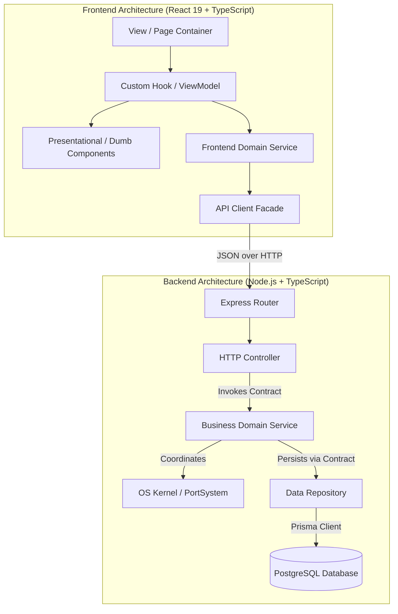
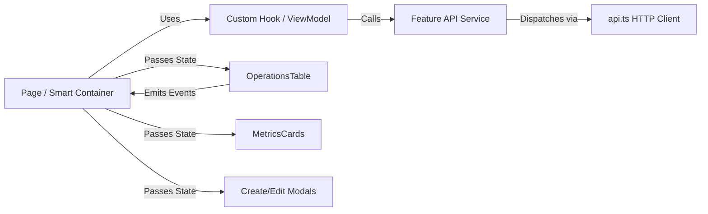

# 🏛️ PortFlow — Low-Level Design (LLD) Architecture Specification

This document details the **Low-Level Design (LLD) Architecture** implemented across both the **Backend** and **Frontend** of the **PortFlow** Smart Maritime Port Management System.

---

## 📑 Table of Contents

1. [Architectural Overview & Core Principles](#1-architectural-overview--core-principles)
2. [Backend LLD Architecture](#2-backend-lld-architecture)
   - [Layered Flow & Separation of Responsibilities](#layered-flow--separation-of-responsibilities)
   - [Models & DTOs Layer](#models--dtos-layer)
   - [Interfaces Layer (Inversion of Control)](#interfaces-layer-inversion-of-control)
   - [Repositories Layer (Data Access)](#repositories-layer-data-access)
   - [Services Layer (Business Logic & OS Kernel Orchestration)](#services-layer-business-logic--os-kernel-orchestration)
   - [Controllers Layer (HTTP Boundary Adapters)](#controllers-layer-http-boundary-adapters)
3. [Frontend LLD Architecture](#3-frontend-lld-architecture)
   - [Client-Side Layered Flow](#client-side-layered-flow)
   - [Smart Container vs. Dumb Presentational Components](#smart-container-vs-dumb-presentational-components)
   - [Custom Hooks as ViewModels / Controllers](#custom-hooks-as-viewmodels--controllers)
   - [Client Service Layer & API Facade](#client-service-layer--api-facade)
4. [Design Patterns Catalog](#4-design-patterns-catalog)
   - [1. Repository Pattern](#1-repository-pattern)
   - [2. Service Layer Pattern](#2-service-layer-pattern)
   - [3. Dependency Injection (DI) & Inversion of Control (IoC)](#3-dependency-injection-di--inversion-of-control-ioc)
   - [4. Singleton Pattern](#4-singleton-pattern)
   - [5. Strategy Pattern (OS Scheduling Algorithms)](#5-strategy-pattern-os-scheduling-algorithms)
   - [6. Observer / Event-Driven Pattern](#6-observer--event-driven-pattern)
   - [7. Facade & Adapter Patterns](#7-facade--adapter-patterns)
   - [8. Container / Presentational Pattern](#8-container--presentational-pattern)
   - [9. Custom Hook (ViewModel / Controller) Pattern](#9-custom-hook-viewmodel--controller-pattern)
   - [10. Compound Component Pattern](#10-compound-component-pattern)
5. [Folder Structure Strategy: Feature-Based vs. Flat-Based](#5-folder-structure-strategy-feature-based-vs-flat-based)
   - [Feature-Based Structure (Vertical Slice Architecture)](#feature-based-structure-vertical-slice-architecture)
   - [Flat-Based Structure (Horizontal Tiered Architecture)](#flat-based-structure-horizontal-tiered-architecture)
   - [Comparative Decision Rubric: When to Use Which](#comparative-decision-rubric-when-to-use-which)
   - [The Hybrid Scalable Architecture (PortFlow Implementation)](#the-hybrid-scalable-architecture-portflow-implementation)

---

## 1. Architectural Overview & Core Principles

PortFlow's software architecture is engineered based on four foundational software design principles:

1. **Separation of Concerns (SoC)**: Every class, module, and component is restricted to a single architectural responsibility (e.g., HTTP routing is completely isolated from business validation; database querying is completely isolated from OS process scheduling).
2. **Dependency Inversion Principle (DIP)**: High-level business modules (Services) do not depend on low-level database drivers (Prisma/SQL). Both depend on domain abstractions (`interfaces/`).
3. **Single Responsibility Principle (SRP)**: Each class or hook has one, and only one, reason to change.
4. **Interface Segregation**: Clients are not forced to depend on methods they do not use; repository and service contracts are scoped to their respective domain models (`IOperationsRepository`, `IShipsRepository`, `ICargoRepository`, etc.).



---

## 2. Backend LLD Architecture

### Layered Flow & Separation of Responsibilities

The backend follows an explicit 5-tier architecture:

| Tier | Role | Responsibilities | Disallowed Actions |
| :--- | :--- | :--- | :--- |
| **Routes** | HTTP Mapping | Maps HTTP verbs (`GET`, `POST`, `PUT`, `DELETE`) and URLs to controller handlers; binds middleware (`requireAuth`, `requireRole`). | Never executes query logic or writes response JSON. |
| **Controllers** | HTTP Adapter | Validates request parameters/body, extracts authenticated user session, invokes domain service, maps domain errors to standard HTTP status codes (`200`, `201`, `400`, `404`, `500`). | Never executes SQL/Prisma queries or contains business rules. |
| **Services** | Business Logic | Validates domain invariants (e.g., IMO format, weight bounds), orchestrates calculations (turnaround time, waiting time), synchronizes with OS Kernel (`PortSystem`, `Scheduler`, `Process`). | Never touches HTTP `Request` or `Response` objects. |
| **Repositories**| Data Access | Executes database queries (Prisma/PostgreSQL), handles query filtering, soft-deletion semantics, and entity normalization. | Never evaluates business rules or triggers OS simulator events. |
| **Models** | Domain Definitions | Pure TypeScript types, interfaces, enums, and DTOs representing state, inputs, and outputs. | Never contains execution logic or library dependencies. |

---

### Models & DTOs Layer
Located in: [`backend/src/models/`](./backend/src/models)

Each domain entity defines:
1. **Entity Record**: The normalized database entity (e.g., `OperationRecord`, `ShipRecord`, `CargoRecord`).
2. **Create DTO**: The validated input contract for creation (`CreateOperationDTO`, `CreateShipDTO`).
3. **Update DTO**: The partial contract for updates (`UpdateOperationDTO`, `UpdateShipDTO`).

Example from [`backend/src/models/operation.model.ts`](./backend/src/models/operation.model.ts):
```typescript
export interface OperationRecord {
    id: number;
    processId: string;
    operation_type: string;
    ship_name: string;
    crane_id: string;
    berth_id: string;
    priority: number;
    status: 'Queued' | 'Running' | 'Completed' | 'Cancelled';
    start_time: string | null;
    end_time: string | null;
    waiting_time_ms: number | null;
    turnaround_time_ms: number | null;
    created_by: string;
    created_at: string;
    deleted_at: string | null;
    deleted_by: string | null;
}

export interface CreateOperationDTO {
    operationType: string;
    shipName: string;
    craneId?: string;
    berthId?: string;
    priority?: number;
    burstDuration?: number;
    created_by: string;
}
```

---

### Interfaces Layer (Inversion of Control)
Located in: [`backend/src/interfaces/`](./backend/src/interfaces)

Interfaces define the contracts that decouple architectural layers:
- [`repositories.interface.ts`](./backend/src/interfaces/repositories.interface.ts): `IOperationsRepository`, `IShipsRepository`, `ICargoRepository`, `IEquipmentRepository`, `ITrashRepository`, `IUserRepository`.
- [`services.interface.ts`](./backend/src/interfaces/services.interface.ts): `IOperationsService`, `IShipsService`, `ICargoService`, `IEquipmentService`, `ITrashService`, `IAuthService`.

Example:
```typescript
export interface IShipsService {
    getShips(): Promise<ShipRecord[]>;
    getShipById(id: number): Promise<ShipRecord | null>;
    createShip(data: CreateShipDTO): Promise<ShipRecord>;
    updateShip(id: number, data: UpdateShipDTO): Promise<ShipRecord | null>;
    deleteShip(id: number, deletedBy: string): Promise<ShipRecord | null>;
}
```

---

### Repositories Layer (Data Access)
Located in: [`backend/src/repositories/`](./backend/src/repositories)

Repositories implement the repository contracts and encapsulate all database interactions. They guarantee that if the underlying database changes (e.g., migrating from Prisma to raw pgPool or MongoDB), the service layer remains completely untouched.

Example from [`backend/src/repositories/ships.repository.ts`](./backend/src/repositories/ships.repository.ts):
```typescript
export class ShipsRepository implements IShipsRepository {
    async findActive(): Promise<ShipRecord[]> {
        const res = await prisma.ship.findMany({
            where: { deleted_at: null },
            orderBy: { created_at: 'desc' }
        });
        return res.map(normalize);
    }
    // ...
}
```

---

### Services Layer (Business Logic & OS Kernel Orchestration)
Located in: [`backend/src/services/`](./backend/src/services)

Services implement the service contracts and encapsulate business rules, input sanitization, and coordination between database persistence and the **Operating System Simulator (`PortSystem`)**:

```typescript
export class OperationsService implements IOperationsService {
    private repo: IOperationsRepository;
    private portSystem: PortSystem;

    constructor(
        repo: IOperationsRepository = operationsRepository,
        portSystem: PortSystem = PortSystem.getInstance()
    ) {
        this.repo = repo;
        this.portSystem = portSystem;
    }

    public async submitOperation(data: CreateOperationDTO): Promise<OperationRecord> {
        // Business validation
        if (!data.operationType || !data.shipName) {
            throw new Error('Operation type and ship name are required.');
        }

        // Persistence
        const operation = await this.repo.create(data);

        // OS Concurrency Integration: Convert to Process and insert in Ready Queue
        const process = new Process(operation.processId, burstTime, requiredEquipments, operation.priority);
        this.portSystem.addProcess(process);

        return operation;
    }
}
```

---

### Controllers Layer (HTTP Boundary Adapters)
Located in: [`backend/src/controllers/`](./backend/src/controllers)

Controllers strictly function as transport-layer adaptors:
```typescript
export const getShips = async (_req: Request, res: Response): Promise<void> => {
    try {
        const ships = await shipsService.getShips();
        res.status(200).json(ships);
    } catch (error: any) {
        res.status(500).json({ success: false, message: error.message });
    }
};
```

---

## 3. Frontend LLD Architecture

### Client-Side Layered Flow



---

### Smart Container vs. Dumb Presentational Components

PortFlow strictly separates React UI logic into two tiers:

1. **Smart (Container) Components** (e.g., [`frontend/src/pages/OperationsPage.tsx`](./frontend/src/pages/OperationsPage.tsx)):
   - Connects to custom hooks (ViewModels).
   - Coordinates modal visibility and user feedback messages (alerts/toasts).
   - Does not render large chunks of raw JSX, styling tags, or form input markup.
2. **Dumb (Presentational) Components** (e.g., [`OperationsTable.tsx`](./frontend/src/features/operations/components/OperationsTable.tsx), [`OperationMetricsCards.tsx`](./frontend/src/features/operations/components/OperationMetricsCards.tsx), [`OperationCreateModal.tsx`](./frontend/src/features/operations/components/OperationCreateModal.tsx)):
   - Pure UI rendering based solely on props (`props in, JSX out`).
   - Completely decoupled from API fetching or global application state.
   - Emits interactions via callback props (`onEdit`, `onDelete`, `onUpdateStatus`).

---

### Custom Hooks as ViewModels / Controllers
Located in: [`frontend/src/features/operations/hooks/useOperations.ts`](./frontend/src/features/operations/hooks/useOperations.ts)

The custom hook encapsulates the entire reactive state and lifecycle of the feature:
- Manages `operations`, `loading`, `submitting`, `error`, `success`.
- Computes derived state: `queuedCount`, `runningCount`, `completedCount`.
- Exposes imperative command methods: `createOperation()`, `updateStatus()`, `deleteOperation()`, `dispatchNextProcess()`, `refresh()`.

---

## 4. Design Patterns Catalog

| # | Design Pattern | Scope | Location in PortFlow | Purpose |
| :- | :--- | :--- | :--- | :--- |
| **1** | **Repository Pattern** | Backend Data | `backend/src/repositories/` | Decouples business logic from persistence technology (Prisma ORM / PostgreSQL). |
| **2** | **Service Layer Pattern** | Backend Domain | `backend/src/services/` | Encapsulates domain logic, validation rules, metric computation, and OS process coordination. |
| **3** | **Dependency Injection (DI)** | Full-Stack | Backend Services & Frontend Hooks | Services accept repository interfaces in constructor; hooks accept service interfaces, enabling 100% isolated unit testing. |
| **4** | **Singleton Pattern** | Backend Core | `PortSystem.getInstance()`, `prisma` client | Ensures only a single OS simulation kernel and single DB connection pool exist across the entire server runtime. |
| **5** | **Strategy Pattern** | OS Concurrency | `backend/src/os/Scheduler.ts` | Allows swapping process scheduling algorithms (`FCFSStrategy`, `SJFStrategy`, `PriorityStrategy`) dynamically at runtime via `ISchedulingStrategy`. |
| **6** | **Observer / Event Pattern**| Frontend Core | `window.dispatchEvent('portflow-unauthorized')` | Decouples HTTP 401 interception in API client from React router navigation. |
| **7** | **Adapter / Facade Pattern**| Full-Stack | `frontend/src/lib/api.ts` & Repo `normalize()` | `api.ts` provides a unified Facade over `fetch()`; `normalize()` adapts raw database records to domain models. |
| **8** | **Container / Presentational**| Frontend UI | `OperationsPage.tsx` + `features/operations/components/` | Separates data querying and orchestration (Container) from visual rendering (Presentational). |
| **9** | **ViewModel / Custom Hook** | Frontend MVVM | `useOperations.ts` | Provides an MVVM ViewModel layer for React, abstracting reactive lifecycle and mutation states. |
| **10**| **Compound Component** | Frontend UI | `components/ui/sidebar.tsx`, `dialog.tsx` | Provides flexible compositional components sharing implicit context state (`SidebarProvider`, `SidebarTrigger`, `SidebarContent`). |

---

## 5. Folder Structure Strategy: Feature-Based vs. Flat-Based

A crucial aspect of production software architecture is choosing the right directory structure for each module based on its complexity and lifecycle.

### Feature-Based Structure (Vertical Slice Architecture)

In a **Feature-Based** structure, all artifacts related to a specific business capability (types, services, hooks, UI components, tests) are co-located in a dedicated domain folder:

```text
frontend/src/features/operations/
├── components/                 # Presentational components specific to operations
│   ├── OperationCreateModal.tsx
│   ├── OperationEditModal.tsx
│   ├── OperationMetricsCards.tsx
│   └── OperationsTable.tsx
├── hooks/                      # Custom hooks / ViewModels
│   └── useOperations.ts
├── services/                   # Feature-level API service
│   └── operations.service.ts
├── types/                      # Domain interfaces, DTOs, and view models
│   └── operation.types.ts
└── index.ts                    # Public barrel export
```

#### Advantages:
1. **High Cohesion**: Everything required to understand, develop, or refactor the feature is in one directory.
2. **Team Scalability**: Multiple developers or squads can work on separate features without git merge conflicts.
3. **Painless Decommissioning**: Deleting or archiving a feature requires removing a single directory without hunting across 6 different global folders.
4. **Micro-Frontend Ready**: Vertical slices can easily be extracted into independent npm packages or micro-frontends.

---

### Flat-Based Structure (Horizontal Tiered Architecture)

In a **Flat-Based** structure, files are grouped strictly by their technical archetype:

```text
backend/src/
├── controllers/                # All HTTP controllers
├── services/                   # All domain services
├── repositories/               # All data access classes
├── models/                     # All entity definitions
└── routes/                     # All Express routes

frontend/src/
├── components/ui/              # Atomic primitives (button, card, dialog)
├── layouts/                    # Application shells
└── lib/                        # Cross-cutting utilities (api.ts, supabase.ts)
```

#### Advantages:
1. **Low Cognitive Overhead for Small Modules**: For simple CRUD entities (e.g., `trash`, `equipment`), having 1 controller, 1 service, and 1 repository avoids deep directory nesting.
2. **Ideal for Shared Infrastructure**: Atomic design system primitives (`components/ui`), layouts, authentication middleware, and database configs naturally belong in flat technical folders.

---

### Comparative Decision Rubric: When to Use Which

| Evaluation Criteria | Use Feature-Based (Vertical Slice) | Use Flat-Based (Horizontal Tier) |
| :--- | :--- | :--- |
| **Domain Complexity** | High (Multi-step workflows, business calculations, OS synchronization). | Low (Standard single-table CRUD operations). |
| **Number of Sub-Components** | High (Modals, charts, tables, drawer panels, filter bars). | Low (Single standard table or form). |
| **Team Size & Velocity** | Multi-developer, concurrent sprints on distinct features. | Single developer or small utility modules. |
| **Reusability** | Domain-specific to that business feature. | Broadly reusable across the entire application (`Button`, `Card`, `AuthGuard`). |
| **Examples in PortFlow** | `features/operations/`, `features/ships/`, `features/cargo/` | `components/ui/`, `layouts/`, `backend/src/repositories/`, `trash` module |

---

### The Hybrid Scalable Architecture (PortFlow Implementation)

PortFlow implements the **Industry-Standard Hybrid Pattern**:
1. **Flat Horizontal Foundation** for cross-cutting infrastructure:
   - Backend: Shared `models/`, `interfaces/`, `config/`, and generic utilities.
   - Frontend: Shared `components/ui/` (Radix/shadcn design system), `layouts/`, `auth/`, and `lib/api.ts`.
2. **Feature-Based Vertical Slices** for complex business modules:
   - Frontend: `features/operations/` encapsulates its own hooks, services, types, and presentation components.
   - Backend: Cohesive service units (`operations.service.ts`, `ships.service.ts`) orchestrating repositories and OS simulation engines through typed interfaces.
