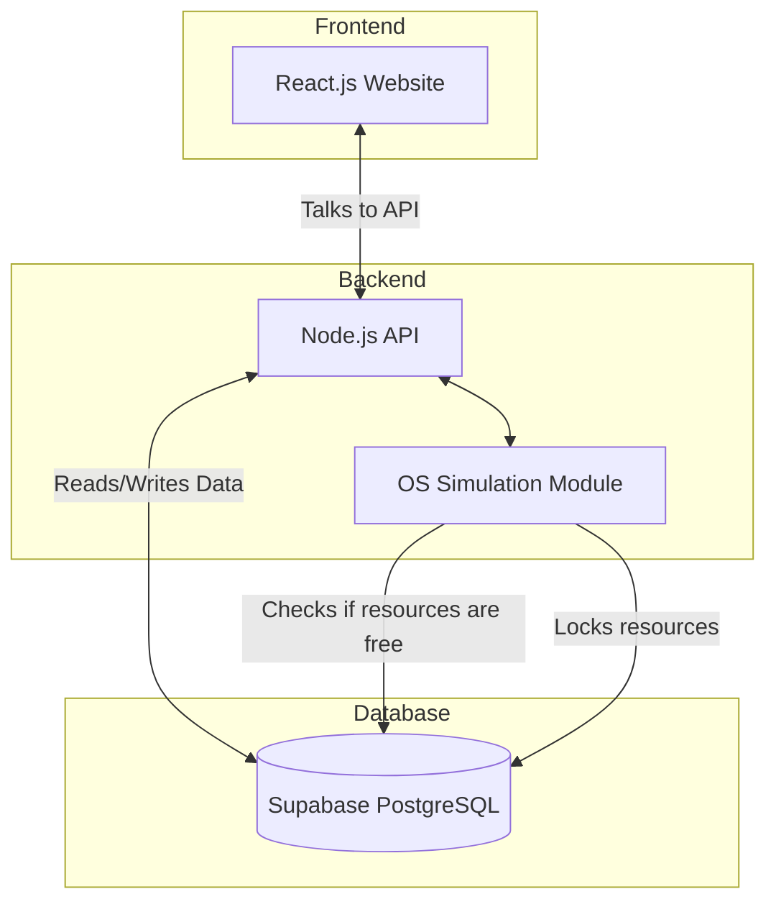
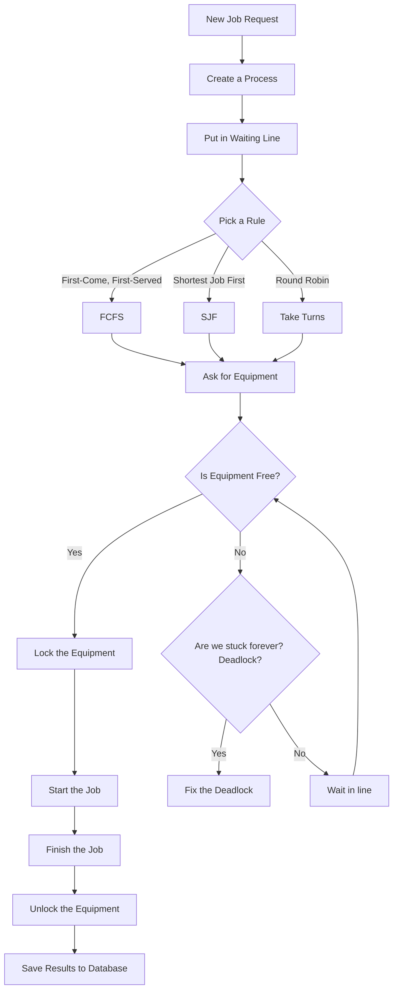
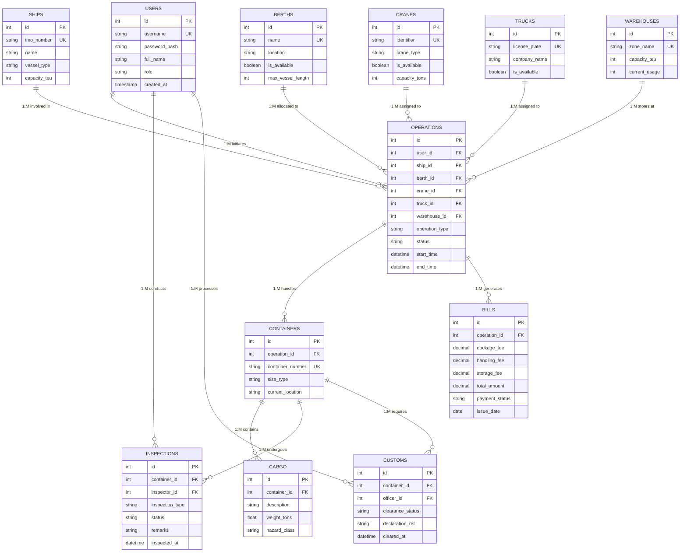
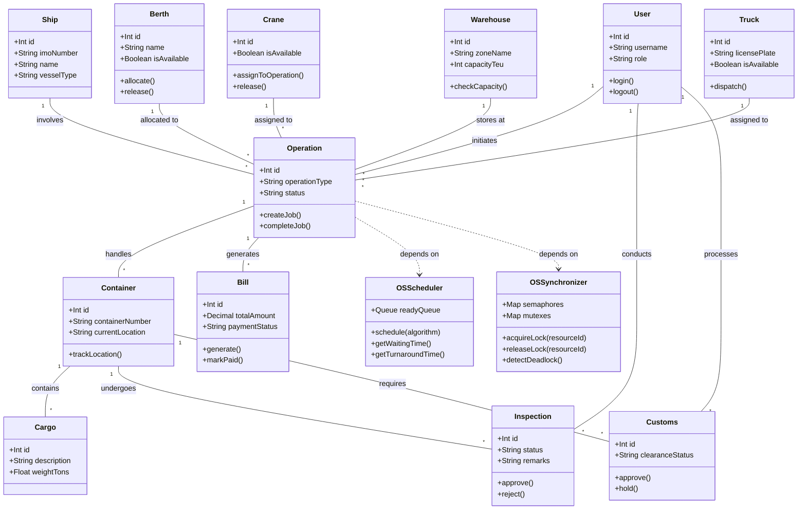
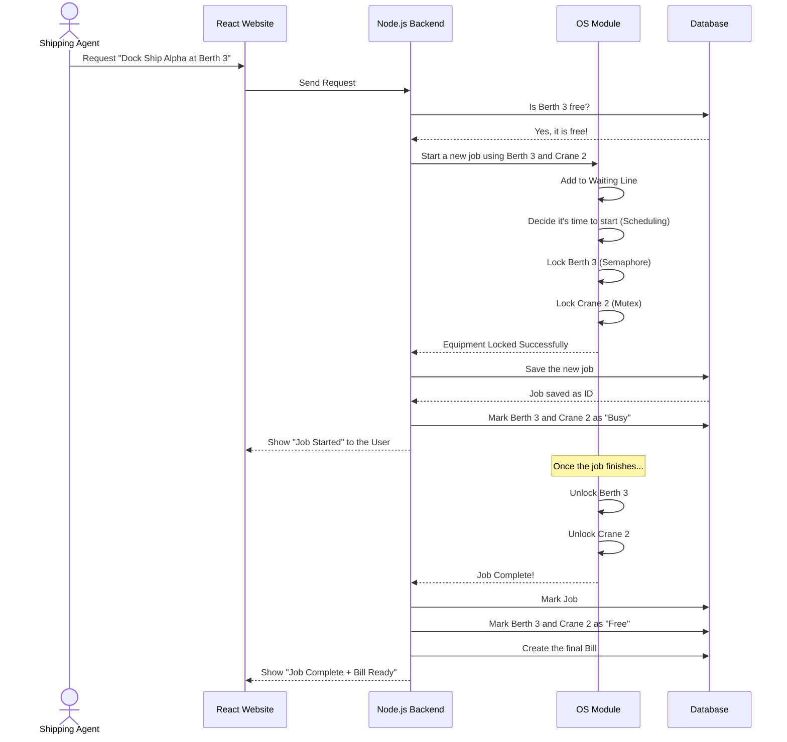
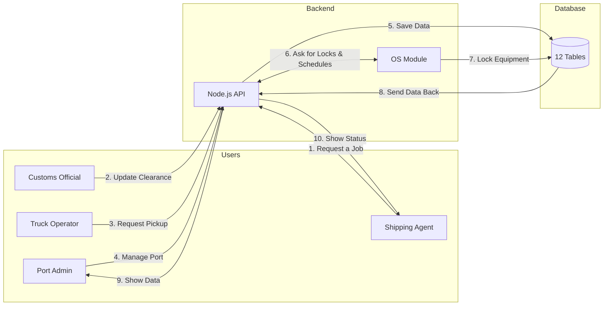
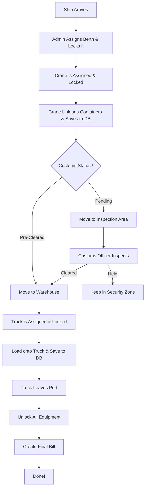

# Phase 1: Complete Project Documentation

**Project Name**: PortFlow
**Tech Stack**: 
- **Frontend**: React.js 
- **Backend**: Node.js / Express (includes our custom OS Module)
- **Database (DBMS)**: Supabase PostgreSQL

---

## 1. Project Overview
PortFlow is a system built to manage everything that happens at a busy port. It keeps track of ships, containers, cargo, places to dock (berths), cranes, warehouses, trucks, customs inspections, and billing.

For this project, we split the logic into two main parts to show how **Operating System (OS)** and **Database (DBMS)** concepts work in real life. 
- The **Database part** uses Supabase PostgreSQL to store all the port data safely. 
- The **OS part** is built directly into our Node.js backend. It acts like a mini operating system that manages port resources—using concepts like CPU scheduling, semaphores, mutexes, and deadlock detection to handle port jobs efficiently.

---

## 2. Objectives
- Make port operations digital and automatic so ships and trucks can move faster.
- See exactly where containers and cargo are at all times.
- Show how OS concepts work by scheduling port resources (like cranes and berths).
- Show how Database concepts work by storing port data properly without repeating information.
- Make it easier for customs to inspect and clear containers.

---

## 3. Features
- **Ships & Berths**: Plan when ships arrive and assign them a place to dock.
- **Containers & Cargo**: Track where containers are and what's inside them.
- **Cranes & Trucks**: Keep an eye on what equipment is being used.
- **Warehouses**: See how much space is left in storage.
- **Customs**: Let customs officials clear or hold containers.
- **Billing**: Automatically create bills for using the port.
- **OS Dashboard**: Watch how the system schedules jobs and locks resources in real-time.
- **Deadlock Detection**: See if port jobs get stuck waiting for each other.

---

## 4. How It Works (Admin vs. User)

### Admin Flow (Port Authority / System Admin)
1. **Login**: Admins log in and see port stats from the database.
2. **Setup**: They add new ships, berths, cranes, warehouses, and trucks to the database.
3. **OS Monitor**: They can watch the system schedule jobs in real-time. They can see waiting times, resource locks, and deadlock warnings (handled by the OS Module).
4. **Billing & Customs**: They can check bills and override customs holds if needed.

### User Flow (Shipping Agent / Crane Operator / Customs Official)
1. **Login**: Users log in and see a dashboard meant just for their job.
2. **Start a Job**: 
   - A Shipping Agent asks the system to do something (like "Unload Ship Alpha at Berth 3 using Crane 2").
   - The React frontend sends this to the Node.js backend, which passes it to our OS Module.
3. **Scheduling (OS part)**:
   - The OS Module puts the job in a waiting line (Ready Queue).
   - It decides which job goes first using rules like FCFS (First-Come, First-Served) or SJF (Shortest Job First).
   - It uses a **Semaphore** to check if a berth is free, and a **Mutex** to lock the crane so no one else can use it at the same time.
   - If jobs get stuck waiting for each other, **Deadlock Detection** catches it.
4. **Doing the Job (DBMS part)**:
   - The Crane Operator updates the container status, which saves to the database.
   - The Customs Official logs their inspection, which also saves to the database.
5. **Finishing Up**:
   - The OS Module unlocks the crane and berth so others can use them.
   - The database updates the job to 'completed'.
   - A bill is automatically created and saved.

```mermaid
flowchart TD
    A[User Login] --> B{Role?}
    B -- Admin --> C[Admin Dashboard]
    B -- Agent --> D[Agent Dashboard]
    B -- Operator --> E[Operator Dashboard]
    B -- Customs --> F[Customs Dashboard]
    
    C --> G[Add Resources to Database]
    C --> H[Watch OS Queues & Deadlocks]
    
    D --> I[Create a Port Job]
    I --> J[OS Module: Waiting Line / Ready Queue]
    J --> K[OS Module: Decide Who Goes Next]
    K --> L[OS Module: Lock the Crane/Berth]
    L --> M[Do the Job]
    M --> N[Database: Update Records]
    N --> O[OS Module: Unlock Resources]
    O --> P[Database: Create Bill]
    
    E --> Q[Update Container Status in Database]
    F --> R[Log Customs Clearance in Database]
```



---

## 5. Modules
1. **User Module**: Handles logins and shows the right dashboard for each person.
2. **Marine Module**: Manages ships, berths, and scheduling.
3. **Terminal Module**: Manages cranes, containers, and moving cargo around.
4. **Logistics Module**: Manages warehouses, trucks, and storage.
5. **Customs Module**: Handles inspections and border clearances.
6. **Billing Module**: Creates and tracks invoices.
7. **OS Simulation Module** *(inside Node.js)*: Does the heavy lifting for scheduling jobs, locking resources, and checking for deadlocks.

---

## 6. System Architecture



---

## 7. OS & DBMS Usage Map

### 7.1 Operating System (OS) Concepts
We built a custom OS Simulation Module inside Node.js to handle these concepts.

| OS Concept                  | PortFlow Feature       | How We Use It in Simple Terms |
| --------------------------- | ---------------------- | ------------------------------------------------------------------- |
| **Process**                 | Port Jobs              | Every job (like unloading a ship) is treated as a process. |
| **CPU Scheduling**          | Job Scheduling         | Deciding which job goes first using FCFS, SJF, or Round Robin rules. |
| **Ready Queue**             | Waiting Line           | A line for jobs that are ready but waiting for their turn. |
| **Waiting Time**            | Time Spent Waiting     | How long a job sits in the waiting line before starting. |
| **Turnaround Time**         | Total Time Taken       | The total time from when the job was asked for until it finished. |
| **Process Synchronization** | Sharing Equipment      | Making sure two jobs don't mess up by trying to use the same crane. |
| **Semaphore**               | Berth Access           | A counter that controls access to resources we have more than one of. |
| **Mutex**                   | Crane Locks            | A lock that makes sure only one job can use a specific crane at a time. |
| **Critical Section**        | Giving Out Resources   | The exact moment we give a crane to a job, where no one else can interrupt. |
| **Deadlock**                | Stuck Jobs             | When jobs get stuck because they are waiting for equipment someone else has. |
| **Deadlock Detection**      | Stuck Job Alert        | The system checks if any jobs are stuck in a loop waiting for each other. |
| **Resource Allocation**     | Handing out Equipment  | Figuring out who gets to use the berths, cranes, and trucks safely. |
| **Multithreading**          | Doing Things at Once   | Handling multiple port jobs at the exact same time. |
| **IPC**                     | Talking Between Parts  | How the main website talks to our custom OS Module. |

#### OS Scheduling Flow


### 7.2 Database (DBMS) Concepts
We use **Supabase PostgreSQL** to store all our data so it's safe, organized, and easy to find.

| DBMS Concept              | PortFlow Feature      | How We Use It in Simple Terms |
| ------------------------- | --------------------- | ------------------------------------------------- |
| **Tables**                | Port Data             | Places to store data like users, ships, and cargo. |
| **Primary Key**           | Unique ID             | A unique number for every single record so we don't mix them up. |
| **Foreign Key**           | Links                 | A way to link a container to the specific ship it came from. |
| **Normalization**         | Clean Design          | Organizing the database so we don't repeat the same data over and over. |
| **Constraints**           | Data Rules            | Rules like "every cargo must have a weight" to keep data clean. |
| **SQL**                   | Data Management       | The language we use to read and write data. |
| **SELECT**                | Dashboard             | Fetching port information to show on the screen. |
| **INSERT**                | New Records           | Adding new ships, cargo, or jobs to the system. |
| **UPDATE**                | Status Changes        | Changing a container's status from 'on ship' to 'in warehouse'. |
| **DELETE**                | Removing Records      | Deleting old or cancelled records safely. |
| **JOIN**                  | Reports               | Combining ship data and bill data together to make a final report. |
| **Aggregate Functions**   | Analytics             | Doing math like COUNT or SUM to see total bills or total containers. |
| **Indexes**               | Fast Searching        | Adding shortcuts so we can search for a container number instantly. |
| **Transactions**          | Safe Saves            | Making sure a complex save either completely works or completely fails (no half-saves). |
| **ACID**                  | Data Reliability      | Making sure the database never loses data or gets confused. |
| **Views**                 | Simple Reports        | Creating easy-to-read summaries of complex data for the dashboard. |
| **Authentication**        | User Logins           | Handling secure sign-ups and logins (using Supabase Auth). |
| **Row-Level Security**    | Access Rules          | Making sure a normal user can't see admin-only data. |
| **Referential Integrity** | Keeping Links Safe    | Stopping someone from deleting a ship if it still has cargo attached to it. |

---

## 8. The Big Picture: How OS and DBMS Work Together

```text
                 React.js (Frontend / Website)
                    │
                    ▼
              Node.js (Backend API)
                    │
          ┌─────────┴──────────────┐
          │                        │
          ▼                        ▼
       Database Part             OS Part (inside Node.js)
          │                        │
 Supabase PostgreSQL         Decides who goes next
          │                  Locks and unlocks equipment
     Stores 12 Tables        Checks for stuck jobs
     Keeps data safe         Manages the waiting line
     Handles the math        Runs the processes
          │                        │
          └────────────┬───────────┘
                       ▼
                 PortFlow System
```

### In Simple Words
| Question | Database Answers | OS Module Answers |
| :--- | :--- | :--- |
| Which berth is free right now? | ✅ (Reads the table) | |
| Who is currently using Crane 2? | ✅ (Reads the table) | |
| Which job should we run next? | | ✅ (Uses Scheduling rules) |
| Can two jobs use the same berth? | | ✅ (Uses Locks to say NO) |
| Are jobs stuck waiting forever? | | ✅ (Detects Deadlocks) |
| What is the total bill? | ✅ (Does the math) | |
| How long did the job wait? | | ✅ (Calculates waiting time) |

---

## 9. Our 12 Database Tables

| #  | Table         | Main Purpose |
| -- | ------------- | --- |
| 1  | `users`       | Stores user accounts and their roles. |
| 2  | `ships`       | Stores details about the ships. |
| 3  | `berths`      | Stores the locations where ships can dock. |
| 4  | `cranes`      | Stores the equipment used to move things. |
| 5  | `warehouses`  | Stores the places where cargo is kept. |
| 6  | `trucks`      | Stores the trucks used to drive cargo away. |
| 7  | `operations`  | The main hub! Connects a user, ship, berth, and crane to a specific job. |
| 8  | `containers`  | Stores the big shipping containers. |
| 9  | `cargo`       | Stores the actual goods inside the containers. |
| 10 | `inspections` | Stores safety and quality checks. |
| 11 | `customs`     | Stores border clearance records. |
| 12 | `bills`       | Stores the final invoices for the work done. |

---

## 10. How the Tables are Connected

Here is a simple list of how our 12 tables talk to each other. Almost everything connects back to the `operations` table.

| # | Parent Table | Child Table | How they connect (1 to Many) |
| :-- | :--- | :--- | :--- |
| 1 | `users` | `operations` | One user can start many operations. |
| 2 | `users` | `inspections` | One inspector can do many inspections. |
| 3 | `users` | `customs` | One officer can clear many customs forms. |
| 4 | `ships` | `operations` | One ship can have many operations done on it. |
| 5 | `berths` | `operations` | One berth can host many operations over time. |
| 6 | `cranes` | `operations` | One crane can be used in many operations. |
| 7 | `trucks` | `operations` | One truck can be assigned to many operations. |
| 8 | `warehouses` | `operations` | One warehouse can be used by many operations. |
| 9 | `operations` | `containers` | One operation can move many containers. |
| 10 | `operations` | `bills` | One operation creates the final bills. |
| 11 | `containers` | `cargo` | One container can hold many items of cargo. |
| 12 | `containers` | `inspections` | One container can be inspected many times. |
| 13 | `containers` | `customs` | One container needs customs clearance. |

---

## 11. Database Diagram (ER Diagram)


---

## 12. Code Blueprint (UML Class Diagram)



---

## 13. Step-by-Step Example: Docking a Ship
This shows exactly what happens behind the scenes when a user asks to dock a ship.



---

## 14. Big Picture Data Flow


---

## 15. The Container's Journey


---

## 16. Academic Summary (For Grading)

### Database (DBMS) Concepts Shown
- **ER Model**: Built using exactly 12 Tables with Primary and Foreign Keys.
- **Normalization**: Data is split into logical tables (like putting ships in one place and cargo in another) to avoid repeating data.
- **SQL**: Used to read, create, update, and delete all records.
- **Transactions**: Making sure multi-step jobs (like saving a job AND locking a crane) either all succeed or all fail safely.
- **Indexes**: Used to make searching for container numbers fast.
- **Aggregate Functions**: Doing math to calculate total bills and container counts.
- **Referential Integrity**: Rules that stop you from deleting a ship if it still has active jobs tied to it.

### Operating System (OS) Concepts Shown
- **Process**: Every port job is treated like a computer process.
- **CPU Scheduling**: We built FCFS (First Come First Serve), SJF (Shortest Job First), and Round Robin rules to decide which job goes next.
- **Ready Queue**: A waiting line for jobs.
- **Semaphore & Mutex**: Locks used to stop two jobs from using the same crane or berth at the same time.
- **Critical Section**: The exact moment we give a crane to a job safely.
- **Deadlock Detection**: We actively check if jobs are stuck waiting for each other in an endless loop.
- **Waiting & Turnaround Time**: We calculate exactly how long jobs had to wait in line.

---

## 17. Our API Endpoints (The URLs we use)
| URL | What it does | Who handles it |
| :--- | :--- | :--- |
| `/api/auth/login` | Logs a user in | Database |
| `/api/auth/register` | Signs a new user up | Database |
| `/api/ships` | Shows or adds ships | Database |
| `/api/berths` | Shows which berths are free | Database |
| `/api/cranes` | Shows which cranes are free | Database |
| `/api/warehouses` | Shows warehouse space | Database |
| `/api/trucks` | Shows or adds trucks | Database |
| `/api/operations` | Starts a new job! | OS + Database |
| `/api/operations/:id` | Checks if a job is done | OS + Database |
| `/api/containers` | Shows or adds containers | Database |
| `/api/cargo` | Shows or adds cargo | Database |
| `/api/inspections` | Updates safety checks | Database |
| `/api/customs` | Updates customs clearance | Database |
| `/api/bills` | Gets the final invoices | Database |
| `/api/os/queue` | Admin: Shows the waiting line | OS |
| `/api/os/schedule` | Admin: Shows scheduling times | OS |
| `/api/os/deadlocks` | Admin: Checks for stuck jobs | OS |
| `/api/os/resources` | Admin: Shows what is locked | OS |

