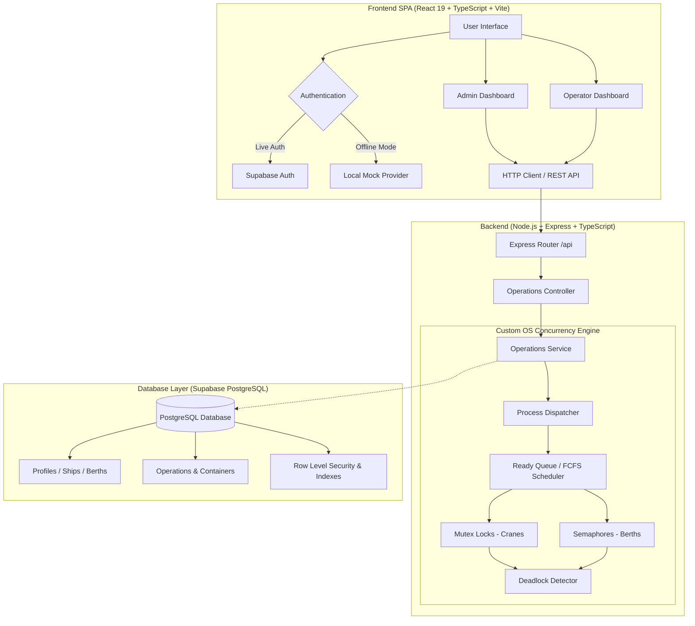

# ⚓ PortFlow — Smart Port Management System

[](https://react.dev/)
[](https://nodejs.org/)
[](https://supabase.com/)
[](https://jestjs.io/)
[](#license)

**PortFlow** is an intelligent, full-stack Maritime Port Management & Operations Terminal designed to digitize port logistics while demonstrating real-world applications of **Operating System (OS)** and **Database Management System (DBMS)** principles.

PortFlow simulates and orchestrates high-throughput vessel dockings, container loading/unloading, crane and berth resource allocation, concurrency control, CPU job scheduling, and ACID-compliant transaction persistence.

---

## 📑 Table of Contents

- [Overview](#-overview)
- [Architecture & Data Flow](#-architecture--data-flow)
- [Core Features](#-core-features)
- [OS & DBMS Theoretical Concepts Mapping](#-os--dbms-theoretical-concepts-mapping)
- [Repository Structure](#-repository-structure)
- [Issues Fixed & Technical Solutions](#-issues-fixed--technical-solutions)
- [Getting Started](#-getting-started)
  - [Prerequisites](#prerequisites)
  - [Backend Setup](#1-backend-setup)
  - [Frontend Setup](#2-frontend-setup)
  - [Database Setup (Optional / Production)](#3-database-setup-optional--production)
- [Test Credentials](#-test-credentials)
- [Running Tests & Build Verification](#-running-tests--build-verification)
- [Milestones & Roadmap](#-milestones--roadmap)
- [License](#-license)

---

## 🌊 Overview

Modern container ports operate around the clock, managing millions of tons of cargo, massive vessels, and scarce physical infrastructure (berths and cranes). PortFlow bridges this maritime domain with computer science fundamentals:

1. **The Custom OS Kernel Simulator (`backend/src/os`)**: Models container operations as system **processes**, manages scarce crane access using **Mutex locks**, handles berth capacity using counting **Semaphores**, schedules tasks via **FCFS (First-Come, First-Served)**, and executes a cycle-detection algorithm for **Deadlock Detection**.
2. **The Database Engine (`backend/supabase/schema.sql`)**: Built on PostgreSQL (Supabase), providing normalized schemas (3NF), foreign-key relational integrity, B-Tree indexes, and Row-Level Security (RLS) policies for Admin and Operator isolation.
3. **The Web Operations Suite (`frontend`)**: A modern, responsive React 19 SPA featuring an interactive Admin Panel, Operator Terminal, live resource state monitors, and instant local development mode.

---

## 🏗 Architecture & Data Flow



---

## ✨ Core Features

- 🚢 **Vessel & Berth Scheduling**: Assign arrival vessels to dedicated berths with capacity validation.
- 🏗 **Crane Allocation with Mutex Synchronization**: Exclusive lock mechanisms ensure no two operations simultaneously commandeer the same crane, preventing physical conflict and race conditions.
- 🚦 **Counting Semaphores for Berths**: Controls access to docks and shared multi-unit infrastructure.
- ⚡ **FCFS Job Queue & CPU Scheduling**: Tracks process states (`Queued`, `Running`, `Completed`), burst times, waiting times, and turnaround times.
- 🔍 **Deadlock Detection Engine**: Continuously inspects resource-allocation graphs (RAG) to detect circular waits and flag deadlocked tasks.
- 🛡 **Role-Based Access Control (RBAC)**: Distinct permissions and views for **Port Administrators** and **Crane/Berth Operators**.
- 🔌 **Dual-Mode Persistence**: Seamlessly switches between live Supabase cloud database operations and offline `localStorage` simulation.

---

## 🧠 OS & DBMS Theoretical Concepts Mapping

### 1. Operating Systems (OS) Concepts

| OS Concept | PortFlow Implementation | Description |
| :--- | :--- | :--- |
| **Process** | Port Operation (`Process.ts`) | Each discharge/loading task is encapsulated as a process with state, ID, priority, and burst time. |
| **Process Scheduling** | `Scheduler.ts` (FCFS Strategy) | Queues jobs in order of arrival and dispatches them sequentially to available execution units. |
| **Ready Queue** | `Scheduler.readyQueue` | In-memory line holding operations that are ready to run pending resource allocation. |
| **Waiting & Turnaround Time** | Telemetry Metrics | Measures exact duration spent waiting in queue vs total time from submission to completion. |
| **Mutual Exclusion (Mutex)** | `Mutex.ts` | Grants exclusive access to a single crane per operation; subsequent requests wait asynchronously. |
| **Counting Semaphore** | `Semaphore.ts` | Controls multi-unit resources (berth slots) ensuring capacity limits are never exceeded. |
| **Critical Section** | Lock Acquisition Block | The code region where crane/berth hardware is engaged; guarded by locks before release. |
| **Deadlock Detection** | `DeadlockDetector.ts` | Implements cycle-detection on the resource wait-for graph to flag circular dependencies. |

### 2. Database Management Systems (DBMS) Concepts

| DBMS Concept | PortFlow Implementation | Description |
| :--- | :--- | :--- |
| **Relational Schema** | `backend/supabase/schema.sql` | Structured tables for `profiles`, `ships`, `berths`, `operations`, and `containers`. |
| **Primary & Foreign Keys** | UUIDs & BigInt Relations | Enforces referential integrity linking containers to operations, and operations to vessels/berths. |
| **Data Normalization (3NF)** | Entities Separation | Eliminates redundancy by segregating ship specifications, berths, profiles, and operations. |
| **Indexes** | B-Tree Indexes | Optimizes search on `operations(user_id)`, `operations(created_at)`, and `containers(operation_id)`. |
| **Row Level Security (RLS)** | PostgreSQL Policies | Restricts data modification and read operations based on authenticated user IDs and roles. |
| **Transactions & ACID** | Relational Ingestion | Guarantees atomic updates when dispatching operations and recording container status changes. |

---

## 📂 Repository Structure

```text
portflow/
├── .gitignore                     # Root gitignore (ignores node_modules, dist, .env)
├── README.md                      # Comprehensive project documentation
├── folder/                        # Academic milestone documentation
│   ├── PHASE_1.md                 # Phase 1: 10% Foundation Milestone & Specs
│   ├── PHASE_2.md                 # Phase 2: 40% Core Working Implementation
│   └── PHASE_3.md                 # Phase 3: 50% Advanced Deployment Roadmap
├── backend/                       # Node.js + Express backend
│   ├── .env.example               # Backend environment template
│   ├── jest.config.js             # Jest test suite configuration
│   ├── package.json               # Backend dependencies & scripts
│   ├── tsconfig.json              # TypeScript compilation configuration
│   ├── src/
│   │   ├── index.ts               # Express application entry point
│   │   ├── config/database.ts     # Supabase backend client configuration
│   │   ├── controllers/           # HTTP Request & Response handlers
│   │   ├── routes/api.ts          # Express API route declarations
│   │   ├── services/              # Business logic & telemetry services
│   │   └── os/                    # Custom OS Simulation Kernel
│   │       ├── Process.ts         # Process abstraction & PCB data model
│   │       ├── Scheduler.ts       # FCFS Scheduling Strategy
│   │       ├── Mutex.ts           # Mutual Exclusion lock primitive
│   │       ├── Semaphore.ts       # Counting Semaphore primitive
│   │       ├── DeadlockDetector.ts# Cycle detection algorithm
│   │       ├── PortSystem.ts      # Singleton OS coordinator
│   │       └── __tests__/         # Unit & Integration tests for OS module
│   └── supabase/
│       └── schema.sql             # Complete PostgreSQL DDL, RLS, & Indexes
└── frontend/                      # React 19 + TypeScript + Vite SPA
    ├── .env.example               # Frontend environment template
    ├── index.html                 # HTML application entry point
    ├── package.json               # Frontend dependencies & scripts
    ├── vite.config.ts             # Vite build & bundler configuration
    ├── public/image/              # Branding assets & role badges
    └── src/
        ├── main.tsx               # React DOM bootstrapping
        ├── App.tsx                # App routing & protected route definitions
        ├── index.css              # Global styles & design system tokens
        ├── auth/                  # RBAC, AuthProvider & Local dev fallback
        ├── lib/supabase.ts        # Frontend Supabase client initialization
        └── pages/
            ├── Login.tsx          # Login & Password recovery view
            ├── AdminDashboard.tsx # Administrator control portal
            ├── OperatorDashboard.tsx # Crane & Berth operator portal
            └── Phase2Dashboard.tsx# Core operational dashboard & visualizer
```

---

## 🛠 Issues Fixed & Technical Solutions

During development and milestone testing, several key issues were identified and systematically resolved:

### 1. Mermaid Parsing & Syntax Errors in Documentation
- **Problem**: Earlier markdown files contained unescaped characters in Mermaid class diagrams and flowchart nodes, causing rendering crashes on GitHub and markdown previewers.
- **Fix**: Refactored all diagram definitions with clean syntax, quoted labels containing special characters, and verified parsing standards.

### 2. Missing Environment Variables & Zero-Config Local Fallback
- **Problem**: When running the application locally without an active Supabase project, missing `.env` credentials triggered unhandled exceptions and prevented testing.
- **Fix**: Implemented a resilient fallback system in `AuthProvider.tsx` and `Login.tsx`. When Supabase credentials are not detected, the app automatically transitions to local simulation mode with pre-configured mock credentials and `localStorage` persistence.

### 3. Cross-Origin Resource Sharing (CORS) & Port Synchronization
- **Problem**: The Vite frontend (`http://localhost:5173`) was initially blocked when querying the Node.js backend (`http://localhost:3000`) for OS telemetry.
- **Fix**: Configured Express `cors()` middleware with appropriate allowed headers and JSON payload parsers in `backend/src/index.ts`, enabling real-time polling of OS states via `/api/os/state`.

### 4. Concurrency Contention & Deadlock Simulation
- **Problem**: Simultaneous multi-crane requests in asynchronous JavaScript could cause unhandled lock states or race conditions.
- **Fix**: Engineered an asynchronous, promise-based `Mutex` and counting `Semaphore` pattern with a dedicated `DeadlockDetector` that constructs a Resource-Allocation Graph (RAG) and traverses for circular waits.

### 5. Repository Bloat Prevention (`.gitignore`)
- **Problem**: The root directory lacked a comprehensive `.gitignore`, causing more than 8,000 files in `node_modules/` and build artifacts (`dist/`) to appear as untracked files.
- **Fix**: Created a unified root `.gitignore` filtering `node_modules/`, `dist/`, local `.env` files, and editor caches across both backend and frontend workspaces.

### 6. Milestone Documentation Organization
- **Problem**: Multiple `PHASE_*.md` files were scattered across the project root without a central entry point.
- **Fix**: Consolidated all phase specifications into a dedicated `folder/` directory and authored a comprehensive, unified `README.md` at the project root.

---

## 🚀 Getting Started

### Prerequisites

- **Node.js**: v18.0.0 or higher
- **npm**: v9.0.0 or higher
- **Git**

---

### 1. Backend Setup

```bash
# Navigate to backend directory
cd backend

# Install dependencies
npm install

# (Optional) Configure environment variables
cp .env.example .env

# Start development server
npm run dev
```

The backend API will start on: **`http://localhost:3000`**  
Endpoints available:
- `GET  /api/operations` — List all port operations
- `POST /api/operations` — Create and schedule an operation
- `POST /api/operations/dispatch` — Dispatch next operation via FCFS
- `GET  /api/os/state` — Query OS Ready Queue, Mutex states & Deadlock alerts

---

### 2. Frontend Setup

In a new terminal window:

```bash
# Navigate to frontend directory
cd frontend

# Install dependencies
npm install

# (Optional) Configure environment variables
cp .env.example .env

# Start Vite development server
npm run dev
```

The frontend SPA will be accessible at: **`http://localhost:5173`**

---

### 3. Database Setup (Optional / Production)

If connecting to a live Supabase project:
1. Create a new project at [supabase.com](https://supabase.com).
2. Open the **SQL Editor** in your Supabase dashboard.
3. Paste and run the contents of [`backend/supabase/schema.sql`](backend/supabase/schema.sql).
4. Update `backend/.env` and `frontend/.env` with your project URL and keys:
   ```env
   VITE_SUPABASE_URL=https://your-project.supabase.co
   VITE_SUPABASE_PUBLISHABLE_KEY=your-publishable-key
   ```

*(Note: If you skip this step, PortFlow will seamlessly run in **Local Offline Mode** with no configuration required).*

---

## 🔑 Test Credentials

PortFlow comes with pre-configured developer accounts for instant testing in both online and offline mode:

| Role | Email Address | Password | Permissions |
| :--- | :--- | :--- | :--- |
| **Port Administrator** | `admin@portflow.com` | `Password123!` | Full control, OS monitor, CRUD operations, Resource configuration |
| **Crane Operator** | `operator@portflow.com` | `Password123!` | Operational dispatch, queue monitoring, container status updates |

---

## 🧪 Running Tests & Build Verification

### Backend Tests (Jest)
Runs unit tests for the OS Module (Process creation, ready queue insertion, and deadlock cycle detection):

```bash
cd backend
npm test
```

### Frontend Build Verification
Validates TypeScript compilation and bundles production assets:

```bash
cd frontend
npm run build
```

---

## 📈 Milestones & Roadmap

- [x] **Phase 1: Project Foundation (10%)** — System documentation, architectural mapping, and entity relationship modeling. ([Details](folder/PHASE_1.md))
- [x] **Phase 2: Core Working Implementation (40%)** — Working Admin and Operator panels, OS scheduling, Mutex synchronization, and CRUD API. ([Details](folder/PHASE_2.md))
- [ ] **Phase 3: Advanced Logistics & Production Deployment (50%)** — Customs clearance, container yard optimization, billing engine, and cloud hosting. ([Details](folder/PHASE_3.md))

---

## 📄 License

This project is licensed under the [ISC License](LICENSE).
