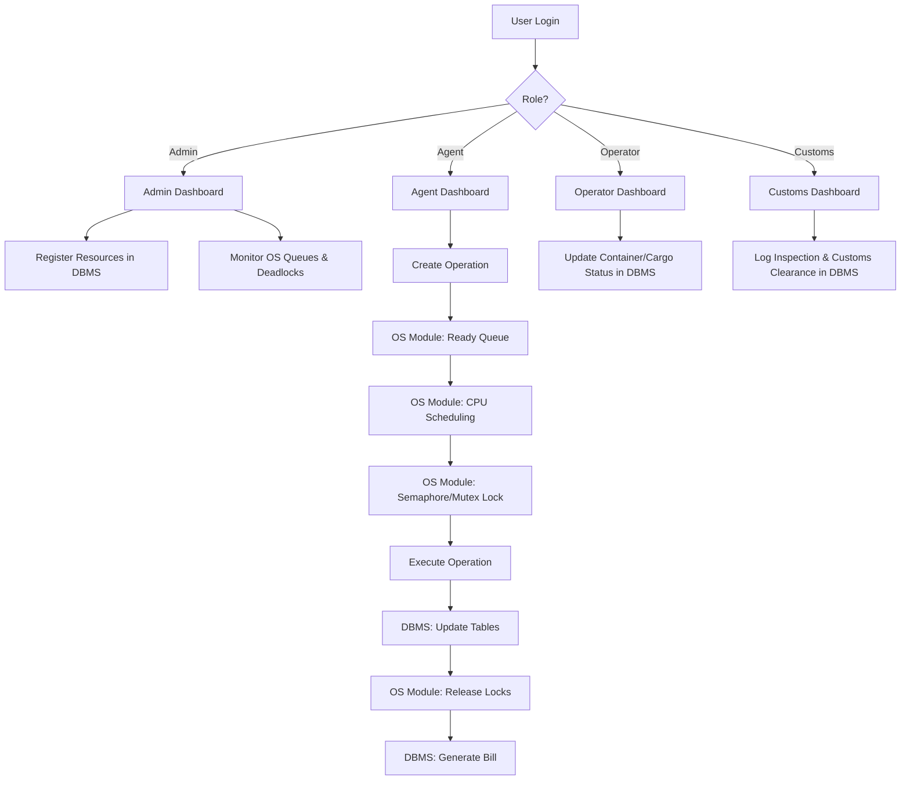
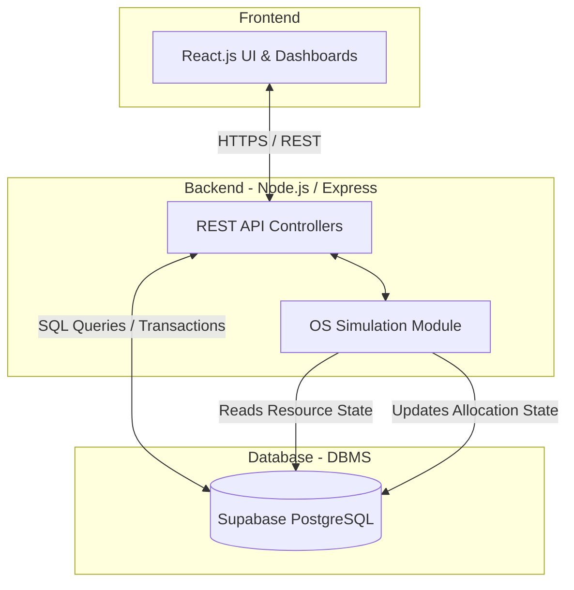
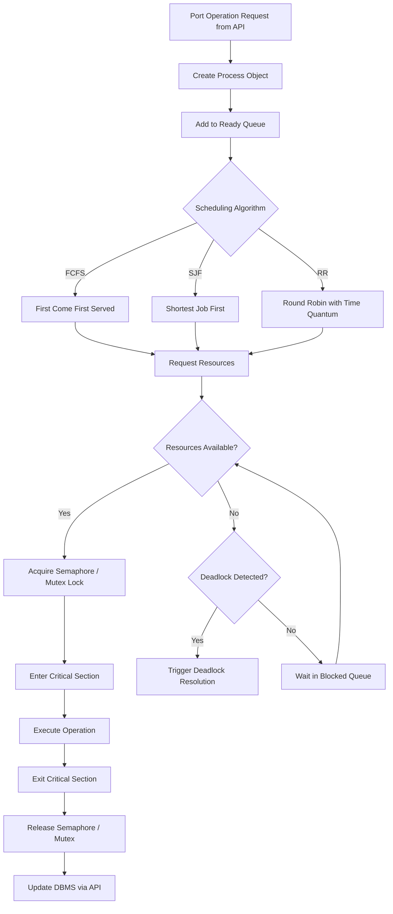
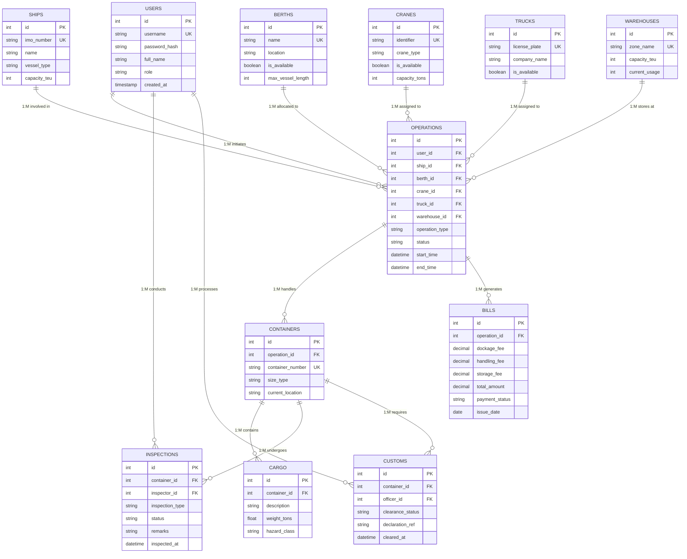
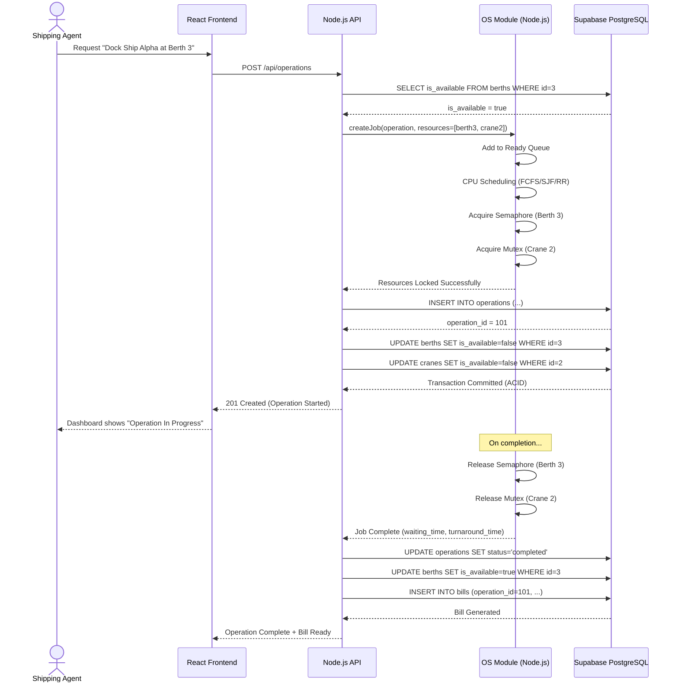
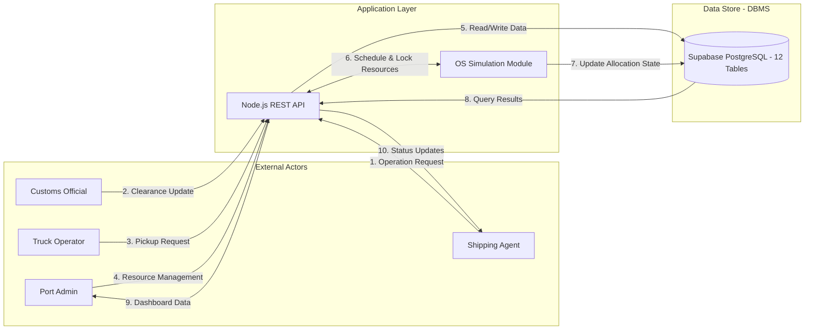
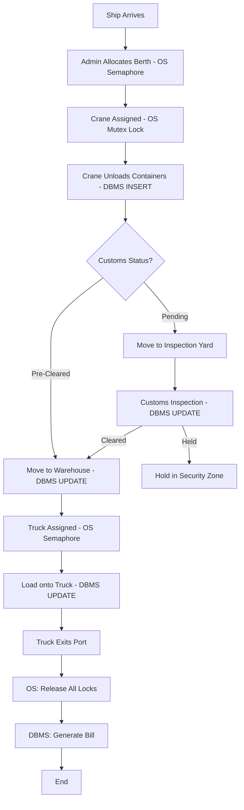
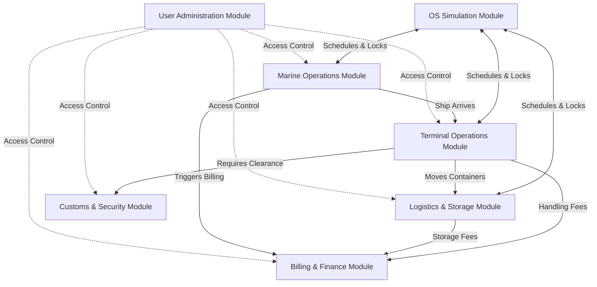

# Phase 1: Complete Project Documentation

**Project Name**: PortFlow
**Tech Stack**: 
- **Frontend**: React.js 
- **Backend**: Node.js / Express (includes OS Simulation Module)
- **Database (DBMS)**: Supabase PostgreSQL

---

## 1. Project Overview
PortFlow is an Integrated Port Operations and Cargo Management System designed to digitally manage the entire lifecycle of port logistics — ships, containers, cargo, berths, cranes, warehouses, trucks, inspections, customs, and billing.

To provide a rigorous academic foundation, PortFlow strictly separates **persistent data management (DBMS)** from **resource scheduling and process management (OS)**. The DBMS layer uses **Supabase PostgreSQL** for ACID-compliant storage. The OS layer is implemented as a **dedicated OS Simulation Module inside the Node.js backend** that demonstrates CPU scheduling, semaphores, mutexes, deadlock detection, and resource allocation — all using real OS concepts applied to port operations.

---

## 2. Objectives
- Digitize and automate port operations to reduce vessel and truck turnaround time.
- Provide real-time visibility into container locations, cargo details, and warehouse utilization.
- Demonstrate OS concepts (scheduling, synchronization, deadlocks) through port resource management.
- Demonstrate DBMS concepts (normalization, transactions, ACID, joins) through persistent port data storage.
- Streamline customs clearance and inspection workflows.

---

## 3. Features
- **Vessel & Berth Management**: Schedule ship arrivals/departures and allocate berths.
- **Container & Cargo Tracking**: Track containers from ship to warehouse to truck.
- **Equipment Management**: Monitor the status and assignments of cranes and trucks.
- **Warehouse Management**: Track storage capacity and locate stored containers.
- **Customs & Inspections**: Dedicated workflows for customs officials to clear or hold containers.
- **Integrated Billing**: Automatically generate invoices based on port operations.
- **OS Scheduling Dashboard**: Visualize ready queues, scheduling algorithms (FCFS/SJF/RR), and resource locks.
- **Deadlock Detection Panel**: Admin view to monitor circular resource waits.

---

## 4. Proper Flow: How It Works (Admin vs. User)

### Admin Flow (Port Authority / System Admin)
1. **Login & Dashboard**: Admin authenticates → Dashboard fetches system-wide stats from **DBMS**.
2. **Resource Registration**: Admin registers new `ships`, `berths`, `cranes`, `warehouses`, and `trucks` → stored in **DBMS**.
3. **OS Monitoring**: Admin views the real-time ready queue, scheduling algorithm outputs (waiting time, turnaround time), semaphore/mutex statuses, and deadlock alerts → powered by **OS Module**.
4. **Billing & Customs Oversight**: Admin reviews `bills` and overrides `customs` holds → **DBMS** queries.

### User Flow (Shipping Agent / Crane Operator / Customs Official)
1. **Login & Role Dashboard**: User authenticates via Supabase Auth → role-specific dashboard.
2. **Operation Creation**:
   - *Shipping Agent* creates a new `operation` (e.g., "Unload Ship Alpha at Berth 3 using Crane 2").
   - React UI → Node.js API → **OS Module** receives the job.
3. **OS Scheduling & Resource Allocation**:
   - OS Module places job in **Ready Queue**.
   - **CPU Scheduling** (FCFS / SJF / Round Robin) determines execution order.
   - **Semaphore** checks if Berth 3 is free. **Mutex** locks Crane 2 during use.
   - If resources are held in a cycle → **Deadlock Detection** flags the conflict.
4. **Execution & DBMS Updates**:
   - *Crane Operator* updates `containers` and `cargo` statuses → **DBMS INSERT/UPDATE**.
   - *Customs Official* logs `inspections` and issues `customs` clearance → **DBMS UPDATE**.
5. **Completion**:
   - OS Module releases semaphores/mutexes → resources become available.
   - Node.js updates operation status in **DBMS**.
   - `bills` are automatically generated → **DBMS INSERT**.



---

## 5. Modules
1. **User Administration Module**: Manages access control, authentication, and role-based dashboards.
2. **Marine Operations Module**: Manages Ships, Berths, and port scheduling.
3. **Terminal Operations Module**: Manages Cranes, Containers, and Cargo handling.
4. **Logistics & Storage Module**: Manages Warehouses, Trucks, and container movements.
5. **Customs & Security Module**: Handles Inspections and customs clearance.
6. **Billing & Finance Module**: Generates and tracks invoices.
7. **OS Simulation Module** *(inside Node.js)*: Implements scheduling algorithms, ready queues, semaphores, mutexes, critical sections, and deadlock detection.

---

## 6. System Architecture



---

## 7. PortFlow — OS & DBMS Usage Map

### 7.1 Operating System (OS) — Where We Use It
Implemented as a **dedicated OS Simulation Module inside Node.js**. No separate C program is needed — Node.js simulates all OS concepts programmatically.

| OS Concept                  | PortFlow Feature       | How It Is Used (Node.js Implementation)                             |
| --------------------------- | ---------------------- | ------------------------------------------------------------------- |
| **Process**                 | Ship/Cargo Operations  | Each operation is modeled as a process object with PID, state       |
| **CPU Scheduling**          | Operation Scheduling   | Schedule port jobs using FCFS, SJF, Round Robin algorithms          |
| **Ready Queue**             | Pending Operations     | Array/queue data structure holding waiting operation objects         |
| **Waiting Time**            | Operation Monitoring   | Calculated per process: start_time - arrival_time                   |
| **Turnaround Time**         | Operation Performance  | Calculated per process: completion_time - arrival_time              |
| **Process Synchronization** | Shared Port Resources  | Prevent multiple operations from conflicting on the same resource   |
| **Semaphore**               | Berth/Crane Access     | Counter-based variable controlling access to limited resources      |
| **Mutex**                   | Critical Sections      | Binary lock ensuring exclusive access to a single resource          |
| **Critical Section**        | Resource Allocation    | Only one operation modifies a resource allocation at a time         |
| **Deadlock**                | Port Resources         | Detect situations where operations wait indefinitely for resources  |
| **Deadlock Detection**      | Resource Monitoring    | Resource Allocation Graph (RAG) analysis for circular waits         |
| **Resource Allocation**     | Berths, Cranes, Trucks | Allocate available resources to operations using Banker's Algorithm |
| **Multithreading**          | Concurrent Operations  | Simulate parallel port operations using async/worker threads        |
| **IPC**                     | Module Communication   | Event emitters / message passing between API and OS Module          |

#### OS Scheduling Flow


### 7.2 DBMS — Where We Use It
The **Supabase PostgreSQL database** handles all persistent storage, relationships, and data integrity.

| DBMS Concept              | PortFlow Feature      | How It Is Used                                    |
| ------------------------- | --------------------- | ------------------------------------------------- |
| **Tables**                | Port Data             | Store users, ships, cargo, resources etc.         |
| **Primary Key**           | Entity Identification | Uniquely identify every record                    |
| **Foreign Key**           | Relationships         | Connect ships, containers, cargo, operations etc. |
| **Normalization**         | Database Design       | Reduce duplicate data (1NF, 2NF, 3NF)            |
| **Constraints**           | Data Validation       | PK, FK, NOT NULL, UNIQUE, CHECK                   |
| **SQL**                   | Data Management       | CRUD and complex queries                          |
| **SELECT**                | Dashboard             | Retrieve port information                         |
| **INSERT**                | New Records           | Add ships/cargo/operations                        |
| **UPDATE**                | Status Changes        | Update resource/operation status                  |
| **DELETE**                | Record Management     | Remove permitted records                          |
| **JOIN**                  | Reports               | Combine related tables for reports                |
| **Aggregate Functions**   | Analytics             | COUNT, SUM, AVG for dashboard metrics             |
| **Indexes**               | Fast Searching        | Improve frequently used queries                   |
| **Transactions**          | Operations            | Keep multi-step database changes consistent       |
| **ACID**                  | Data Reliability      | Atomicity, Consistency, Isolation, Durability     |
| **Views**                 | Reports/Dashboard     | Simplify complex queries for frontend             |
| **Authentication**        | User Management       | Supabase Auth (JWT-based)                         |
| **Row-Level Security**    | Authorization         | Control access to records based on user role      |
| **Referential Integrity** | Relationships         | Prevent invalid FK references                     |

---

## 8. Most Important: OS + DBMS Connection

```text
                 React.js (Frontend)
                    │
                    ▼
              Node.js / Express (Backend)
                    │
          ┌─────────┴──────────────┐
          │                        │
          ▼                        ▼
       DBMS Layer              OS Module (inside Node.js)
          │                        │
 Supabase PostgreSQL         Scheduling (FCFS/SJF/RR)
          │                  Synchronization (Mutex/Semaphore)
     12 Tables               Deadlock Detection (RAG)
     Transactions            Resource Allocation
     Indexes                 Ready/Blocked Queues
     ACID Compliance         Process Management
          │                        │
          └────────────┬───────────┘
                       ▼
                 PortFlow System
```

### In Simple Words
| Question | DBMS Answers | OS Module Answers |
| :--- | :--- | :--- |
| Which berth is available? | ✅ SELECT query | |
| Who is using Crane 2? | ✅ JOIN query | |
| Which operation runs first? | | ✅ CPU Scheduling |
| Can two operations use the same berth? | | ✅ Semaphore/Mutex |
| Are operations stuck waiting forever? | | ✅ Deadlock Detection |
| What is the total bill? | ✅ Aggregate SUM | |
| How long did the operation wait? | | ✅ Waiting Time calc |

---

## 9. Exactly 12 Tables — DBMS Mapping

| #  | Table         | PK | Key Foreign Keys | Main DBMS Purpose |
| -- | ------------- | -- | --- | --- |
| 1  | `users`       | `id` | — | User accounts and roles |
| 2  | `ships`       | `id` | — | Vessel registry |
| 3  | `berths`      | `id` | — | Dock locations |
| 4  | `cranes`      | `id` | — | Loading/unloading equipment |
| 5  | `warehouses`  | `id` | — | Storage facilities |
| 6  | `trucks`      | `id` | — | Transport vehicles |
| 7  | `operations`  | `id` | `user_id`, `ship_id`, `berth_id`, `crane_id`, `truck_id`, `warehouse_id` | Central operation hub (OS ↔ DBMS link) |
| 8  | `containers`  | `id` | `operation_id` | Shipping containers |
| 9  | `cargo`       | `id` | `container_id` | Goods inside containers |
| 10 | `inspections` | `id` | `container_id`, `inspector_id` | Safety/quality checks |
| 11 | `customs`     | `id` | `container_id`, `officer_id` | Customs clearance records |
| 12 | `bills`       | `id` | `operation_id` | Invoices for port services |

---

## 10. Table Relationships Reference

All 13 relationships across the 12 tables, with cardinality, type, and FK mapping:

| # | Parent Table | Child Table | Cardinality | Relationship Type | FK Column (in Child) | Description |
| :-- | :--- | :--- | :--- | :--- | :--- | :--- |
| 1 | `users` | `operations` | 1 : M | One-to-Many | `user_id` | One user initiates many operations |
| 2 | `users` | `inspections` | 1 : M | One-to-Many | `inspector_id` | One inspector conducts many inspections |
| 3 | `users` | `customs` | 1 : M | One-to-Many | `officer_id` | One officer processes many customs clearances |
| 4 | `ships` | `operations` | 1 : M | One-to-Many | `ship_id` | One ship is involved in many operations |
| 5 | `berths` | `operations` | 1 : M | One-to-Many | `berth_id` | One berth is allocated to many operations (over time) |
| 6 | `cranes` | `operations` | 1 : M | One-to-Many | `crane_id` | One crane is assigned to many operations |
| 7 | `trucks` | `operations` | 1 : M | One-to-Many | `truck_id` | One truck is assigned to many operations |
| 8 | `warehouses` | `operations` | 1 : M | One-to-Many | `warehouse_id` | One warehouse is used by many operations |
| 9 | `operations` | `containers` | 1 : M | One-to-Many | `operation_id` | One operation handles many containers |
| 10 | `operations` | `bills` | 1 : M | One-to-Many | `operation_id` | One operation generates one or more bills |
| 11 | `containers` | `cargo` | 1 : M | One-to-Many | `container_id` | One container holds many cargo items |
| 12 | `containers` | `inspections` | 1 : M | One-to-Many | `container_id` | One container undergoes many inspections |
| 13 | `containers` | `customs` | 1 : M | One-to-Many | `container_id` | One container requires customs clearance records |

### Relationship Rules (Referential Integrity)
- Every FK column has a **FOREIGN KEY constraint** referencing its parent table's PK.
- **ON DELETE RESTRICT** — prevents deleting a parent record that has child records (e.g., cannot delete a ship that has active operations).
- **NOT NULL** on critical FKs — every container must belong to an operation, every cargo must belong to a container.
- The `operations` table is the **central hub** connecting 6 parent tables (users, ships, berths, cranes, trucks, warehouses).

---

## 11. ER Diagram (Entity-Relationship)


---

## 12. Class Diagram (UML)

### Relationships shown in UML notation:
- **Association (solid line `──`)**: A structural link between classes. The numbers show cardinality (e.g., `1` to `*` means One-to-Many).
- **Dependency (dashed line `..>`)**: A "uses" relationship where one class depends on another at runtime but doesn't own it.

```mermaid
classDiagram
    class User {
        +Int id
        +String username
        +String role
        +login()
        +logout()
    }
    class Ship {
        +Int id
        +String imoNumber
        +String name
        +String vesselType
    }
    class Berth {
        +Int id
        +String name
        +Boolean isAvailable
        +allocate()
        +release()
    }
    class Crane {
        +Int id
        +Boolean isAvailable
        +assignToOperation()
        +release()
    }
    class Warehouse {
        +Int id
        +String zoneName
        +Int capacityTeu
        +checkCapacity()
    }
    class Truck {
        +Int id
        +String licensePlate
        +Boolean isAvailable
        +dispatch()
    }
    class Operation {
        +Int id
        +String operationType
        +String status
        +createJob()
        +completeJob()
    }
    class Container {
        +Int id
        +String containerNumber
        +String currentLocation
        +trackLocation()
    }
    class Cargo {
        +Int id
        +String description
        +Float weightTons
    }
    class Inspection {
        +Int id
        +String status
        +String remarks
        +approve()
        +reject()
    }
    class Customs {
        +Int id
        +String clearanceStatus
        +approve()
        +hold()
    }
    class Bill {
        +Int id
        +Decimal totalAmount
        +String paymentStatus
        +generate()
        +markPaid()
    }
    class OSScheduler {
        +Queue readyQueue
        +schedule(algorithm)
        +getWaitingTime()
        +getTurnaroundTime()
    }
    class OSSynchronizer {
        +Map semaphores
        +Map mutexes
        +acquireLock(resourceId)
        +releaseLock(resourceId)
        +detectDeadlock()
    }

    User "1" -- "*" Operation : 1:M initiates
    Ship "1" -- "*" Operation : 1:M involves
    Berth "1" -- "*" Operation : 1:M allocated to
    Crane "1" -- "*" Operation : 1:M assigned to
    Warehouse "1" -- "*" Operation : 1:M stores at
    Truck "1" -- "*" Operation : 1:M assigned to
    Operation "1" -- "*" Container : 1:M handles
    Operation "1" -- "*" Bill : 1:M generates
    Container "1" -- "*" Cargo : 1:M contains
    Container "1" -- "*" Inspection : 1:M undergoes
    Container "1" -- "*" Customs : 1:M requires
    User "1" -- "*" Inspection : 1:M conducts
    User "1" -- "*" Customs : 1:M processes
    Operation ..> OSScheduler : depends on
    Operation ..> OSSynchronizer : depends on
```

### UML Relationship Summary
| Relationship | Type | Cardinality | Meaning |
| :--- | :--- | :--- | :--- |
| User → Operation | Association | 1 : M | One user creates many operations |
| Ship → Operation | Association | 1 : M | One ship is part of many operations |
| Berth → Operation | Association | 1 : M | One berth hosts many operations |
| Crane → Operation | Association | 1 : M | One crane serves many operations |
| Warehouse → Operation | Association | 1 : M | One warehouse used in many operations |
| Truck → Operation | Association | 1 : M | One truck assigned to many operations |
| Operation → Container | Association | 1 : M | One operation handles many containers |
| Operation → Bill | Association | 1 : M | One operation generates bills |
| Container → Cargo | Association | 1 : M | One container holds many cargo items |
| Container → Inspection | Association | 1 : M | One container undergoes many inspections |
| Container → Customs | Association | 1 : M | One container has customs records |
| User → Inspection | Association | 1 : M | One inspector conducts many inspections |
| User → Customs | Association | 1 : M | One officer processes many clearances |
| Operation → OSScheduler | Dependency | — | Operation depends on scheduler at runtime |
| Operation → OSSynchronizer | Dependency | — | Operation depends on synchronizer at runtime |

---

## 12. Sequence Diagram: Full Berth Allocation with OS + DBMS


---

## 13. Data Flow Diagram


---

## 14. Flowchart: Container Lifecycle


---

## 15. Module Relationships


---

## 16. Academic Mapping Summary

### DBMS Subject → PortFlow
```text
ER Model → 12 Tables with PK/FK
Relational Model → Normalized to 3NF
SQL → All CRUD operations
Transactions → Multi-step operation updates (ACID)
Indexes → Fast lookups on container_number, imo_number
Views → Dashboard aggregation queries
Joins → Reports combining operations + ships + bills
Aggregate Functions → COUNT, SUM, AVG for analytics
Row-Level Security → Role-based data access
Referential Integrity → FK constraints prevent orphan records
```

### OS Subject → PortFlow
```text
Process → Each port operation = one process
CPU Scheduling → FCFS, SJF, Round Robin for operation ordering
Ready Queue → Pending operations queue
Semaphore → Controls access to berths, cranes (counted resources)
Mutex → Exclusive lock on single resources during critical section
Critical Section → Only one operation modifies resource allocation
Deadlock Detection → Resource Allocation Graph for circular waits
Waiting Time → Time operation spends in ready queue
Turnaround Time → Total time from request to completion
IPC → Event emitters between API controllers and OS module
Multithreading → Concurrent operation simulation via worker threads
```

---

## 17. API Structure (RESTful Endpoints)
| Endpoint | Method | Description | Layer |
| :--- | :--- | :--- | :--- |
| `/api/auth/login` | POST | Authenticate user | DBMS |
| `/api/auth/register` | POST | Register new user | DBMS |
| `/api/ships` | GET/POST | List/register ships | DBMS |
| `/api/berths` | GET | Check berth availability | DBMS |
| `/api/cranes` | GET | Check crane availability | DBMS |
| `/api/warehouses` | GET | Check warehouse capacity | DBMS |
| `/api/trucks` | GET/POST | List/register trucks | DBMS |
| `/api/operations` | POST | Create operation (triggers OS scheduling) | OS + DBMS |
| `/api/operations/:id` | GET | Get operation status + OS metrics | OS + DBMS |
| `/api/containers` | GET/POST | List/add containers | DBMS |
| `/api/cargo` | GET/POST | List/add cargo details | DBMS |
| `/api/inspections` | GET/PUT | View/update inspections | DBMS |
| `/api/customs` | GET/PUT | View/update customs clearance | DBMS |
| `/api/bills` | GET | Retrieve invoices | DBMS |
| `/api/os/queue` | GET | View current ready queue | OS |
| `/api/os/schedule` | GET | View scheduling output (times) | OS |
| `/api/os/deadlocks` | GET | Check for deadlock status | OS |
| `/api/os/resources` | GET | View semaphore/mutex states | OS |
