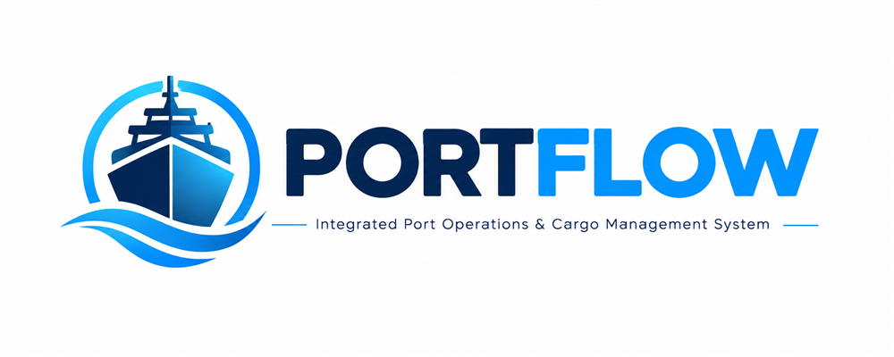
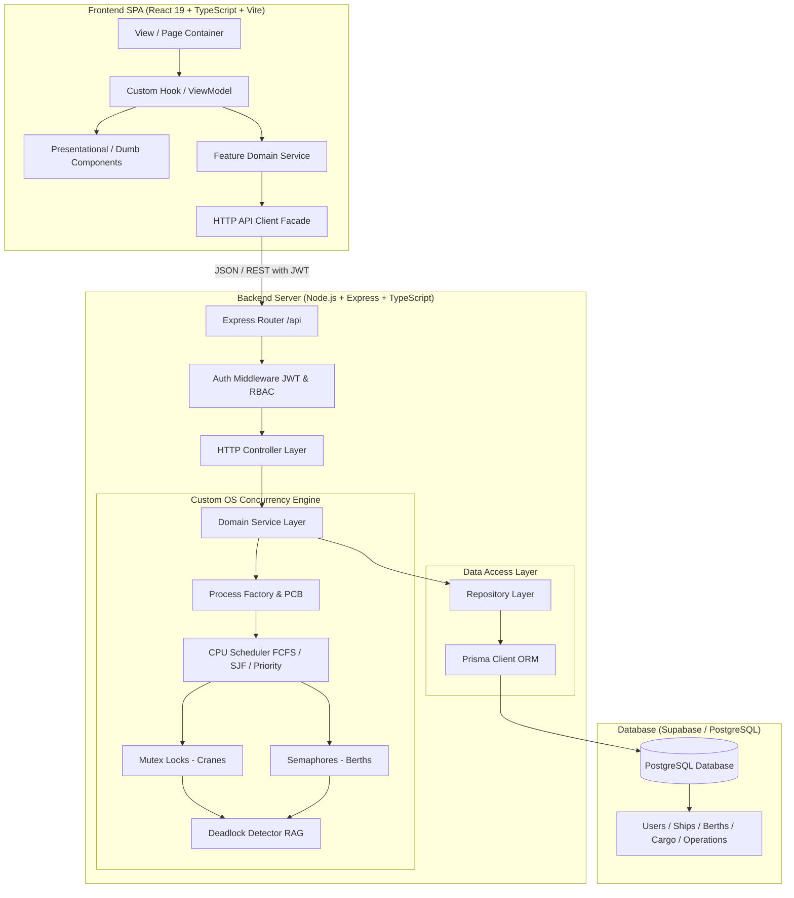

<div align="center">
  

# ⚓ PortFlow — Smart Maritime Port Management System

**An Intelligent Full-Stack Maritime Operations Suite with Custom OS & DBMS Simulation Engines**

[](https://react.dev/)
[](https://nodejs.org/)
[](https://supabase.com/)
[](https://www.prisma.io/)
[](#-architecture--data-flow)
[](#-license)

</div>

---

## 📑 Table of Contents

- [🌊 Overview](#-overview)
- [🏛️ System Architecture & LLD Design](#️-system-architecture--lld-design)
- [🧠 Operating System (OS) Concepts](#-operating-system-os-concepts)
- [💾 Database (DBMS) Concepts](#-database-dbms-concepts)
- [✨ User Roles & Core Features](#-user-roles--core-features)
- [📂 Repository Structure](#-repository-structure)
- [🚀 Quick Start & Installation](#-quick-start--installation)
- [🔑 Test Credentials](#-test-credentials)
- [📈 Project Milestones & Roadmap](#-project-milestones--roadmap)
- [📚 Detailed Sub-Guides](#-detailed-sub-guides)
- [📄 License](#-license)

---

## 🌊 Overview

Modern commercial ports operate 24/7, coordinating massive container ships, heavy cargo inventory, and limited physical infrastructure (berths and cranes). **PortFlow** bridges maritime logistics with fundamental computer science principles:

1. **Custom OS Simulation Kernel**: Treats port jobs as operating system **processes**, manages scarce crane access through **Mutex locks**, models berth parking capacity using counting **Semaphores**, and dynamically schedules waiting jobs via selectable algorithms (**FCFS, SJF, Priority**).
2. **Robust Database Layer**: Powered by PostgreSQL and Prisma ORM, utilizing 3NF relational normalization, foreign-key constraints, soft-delete audit trails, and transactional integrity.
3. **Enterprise Low-Level Design (LLD)**: Built with clean separation of responsibilities on both backend (Controllers $\rightarrow$ Services $\rightarrow$ Repositories $\rightarrow$ Models/Interfaces) and frontend (Smart Containers $\rightarrow$ ViewModels/Custom Hooks $\rightarrow$ Presentational Components).
4. **Interactive Operations Terminal**: A modern React 19 web suite featuring an **Admin Management Portal** and an **Operator Ground Terminal**.

---

## 🏛️ System Architecture & LLD Design

PortFlow utilizes a multi-tiered, loosely coupled architecture adhering to SOLID principles and classical software design patterns:


```mermaid
flowchart TD
    subgraph Client["Frontend SPA (React 19 + TypeScript + Vite)"]
        UI[View / Page Container]
        Hook[Custom Hook / ViewModel]
        Presentational[Presentational / Dumb Components]
        FeatService[Feature Domain Service]
        APIFacade[HTTP API Client Facade]

        UI --> Hook
        Hook --> Presentational
        Hook --> FeatService
        FeatService --> APIFacade
    end

    APIFacade -->|JSON / REST with JWT| Router

    subgraph Server["Backend Server (Node.js + Express + TypeScript)"]
        Router[Express Router /api]
        AuthMid[Auth Middleware JWT & RBAC]
        Controller[HTTP Controller Layer]
        Service[Domain Service Layer]

        Router --> AuthMid --> Controller
        Controller --> Service

        subgraph OS_Kernel["Custom OS Concurrency Engine"]
            Service --> ProcessMgr[Process Factory & PCB]
            ProcessMgr --> Scheduler[CPU Scheduler FCFS / SJF / Priority]
            Scheduler --> MutexLocks[Mutex Locks - Cranes]
            Scheduler --> Semaphores[Semaphores - Berths]
            MutexLocks & Semaphores --> Deadlock[Deadlock Detector RAG]
        end

        subgraph Data_Layer["Data Access Layer"]
            Service --> Repo[Repository Layer]
            Repo --> PrismaORM[Prisma Client ORM]
        end
    end

    subgraph Storage["Database (Supabase / PostgreSQL)"]
        PrismaORM --> PostgresDB[(PostgreSQL Database)]
        PostgresDB --> Tables[Users / Ships / Berths / Cargo / Operations]
    end
```

### Design Patterns Used
- **Repository Pattern**: Decouples business rules from database queries ([`backend/src/repositories/`](./backend/src/repositories)).
- **Service Layer Pattern**: Encapsulates business logic, metric calculations, and OS kernel synchronization ([`backend/src/services/`](./backend/src/services)).
- **Strategy Pattern**: Swappable scheduling algorithms (`FCFSStrategy`, `SJFStrategy`, `PriorityStrategy`) via `SchedulingStrategy` interface ([`backend/src/os/Scheduler.ts`](./backend/src/os/Scheduler.ts)).
- **Singleton Pattern**: Guarantees single instances of the OS Simulator ([`PortSystem.getInstance()`](./backend/src/os/PortSystem.ts)) and DB connection pool ([`prisma.ts`](./backend/src/config/prisma.ts)).
- **Dependency Injection (DI)**: Inversion of control via TypeScript interfaces ([`backend/src/interfaces/`](./backend/src/interfaces)).
- **Container / Presentational Pattern**: Smart containers orchestrate state, while dumb components handle pure UI rendering ([`frontend/src/features/operations/`](./frontend/src/features/operations)).
- **Custom Hook / ViewModel Pattern**: React hooks (`useOperations.ts`) manage local state, caching, and async API dispatch.

---

## 🧠 Operating System (OS) Concepts

| OS Concept | Maritime Analogy | Implementation in PortFlow | Code Location |
| :--- | :--- | :--- | :--- |
| **Process & PCB** | Ship loading / unloading job | Each task is an isolated `Process` with PID, burst time, priority, and state (`READY`, `RUNNING`, `TERMINATED`). | [`backend/src/os/Process.ts`](./backend/src/os/Process.ts) |
| **CPU Scheduling** | Crane work sequencing | Jobs in the ready queue are scheduled using **FCFS**, **SJF**, or **Priority** algorithms. | [`backend/src/os/Scheduler.ts`](./backend/src/os/Scheduler.ts) |
| **Ready Queue** | Waiting line for equipment | Queue where operations wait until cranes and berths are allocated. | [`backend/src/os/Scheduler.ts`](./backend/src/os/Scheduler.ts) |
| **Mutex Lock** | Exclusive Crane access | Only **one** job can operate a specific crane simultaneously to avoid collisions. | [`backend/src/os/Mutex.ts`](./backend/src/os/Mutex.ts) |
| **Counting Semaphore** | Berth capacity slots | Limits simultaneous docking to the available parking berths. | [`backend/src/os/Semaphore.ts`](./backend/src/os/Semaphore.ts) |
| **Deadlock Detection** | Circular wait detection | Continuously checks Resource Allocation Graphs (RAG) to detect circular waits. | [`backend/src/os/DeadlockDetector.ts`](./backend/src/os/DeadlockDetector.ts) |
| **Telemetry & Metrics**| CPU utilization metrics | Tracks exact Waiting Time ($W_t$) and Turnaround Time ($T_t$) per process. | [`backend/src/services/operations.service.ts`](./backend/src/services/operations.service.ts) |

---

## 💾 Database (DBMS) Concepts

| DBMS Principle | Application in PortFlow | How It Works |
| :--- | :--- | :--- |
| **Relational Integrity** | Foreign Keys (`1:N` relations) | Links Operations to Ships, Berths, and Cargo items safely. |
| **3NF Normalization** | Redundancy elimination | Normalized tables for `users`, `ships`, `cargo`, `operations`, and `equipment`. |
| **Soft Deletes (Recycle Bin)** | Audit safety & data recovery | Records set `deleted_at` timestamp rather than hard deletion, managed via the unified Trash Bin. |
| **B-Tree Indexing** | Fast search & retrieval | Indexed lookup on IMO numbers, container numbers, and process IDs. |
| **Aggregate Analytics** | Real-time reporting | SQL aggregate queries (`COUNT`, `AVG`, `SUM`) compute port KPIs, turnaround averages, and berth loads. |
| **Transactions** | Atomic state consistency | Ensures OS lock release and database record updates succeed or roll back together. |

---

## ✨ User Roles & Core Features

| Module | Admin |  Operator |
| :--- | :--- | :--- |
| **Primary Role** | Manages the whole port and system | Handles daily terminal operations |
| **Dashboard** | Views all port activities and resources | Views assigned work and task status |
| **Operations** | Creates, assigns, updates and manages all operations | Creates and updates assigned operations |
| **Ships** | Manages ships, schedules and assignments | Views assigned ships and updates operational status |
| **Cargo** | Manages and monitors all cargo and yard activities | Handles cargo movement and status updates |
| **Berths** | Assigns and manages berths | Uses assigned berth and views its status |
| **Cranes** | Assigns and manages cranes | Uses assigned crane and reports problems |
| **Trucks** | Manages truck allocation and availability | Uses assigned trucks |
| **Scheduling** | Uses and monitors the automatic scheduler | Uses and monitors the automatic scheduler |
| **Scheduling Algorithm** | Uses and configures the active algorithm (FCFS / SJF / Priority) | Uses the configured algorithm |
| **Ready / Running / Waiting Queue** | Monitors all queues and processes | Views relevant queues and assigned jobs |
| **Process Execution** | Monitors port processes | Executes assigned processes |
| **Resource & Locks** | Monitors resource allocation and Mutex/Semaphore locks | Views assigned resource status |
| **Deadlock / Banker's Algorithm** | Monitors deadlock and resource state | Views warnings and reports issues |
| **Analytics** | Views complete port analytics | Views operational/assigned analytics |
| **Reports** | Reviews and manages reports | Creates and views operational reports |
| **Incidents** | Receives and resolves incidents | Reports operational incidents |
| **System Logs** | Monitors system activity | ❌ No access |
| **Database Analytics** | Monitors database/system health | ❌ No access |
| **Audit Trail** | Reviews user and system activities | ❌ No access |
| **Trash / Recovery** | Restores or permanently removes deleted data | ❌ No access |
| **User Management** | Manages users and roles | ❌ No access |

---

## 📂 Repository Structure

```text
portflow/
├── README.md                      # Primary project documentation (you are here)
├── LLD_ARCHITECTURE.md            # Comprehensive Low-Level Design specification
├── folder/                        # Project milestone specifications & guides
│   ├── PHASE_1.md                 # Phase 1: 10% Foundation Milestone
│   ├── PHASE_2.md                 # Phase 2: 40% Core Working Implementation
│   ├── PHASE_3.md                 # Phase 3: 50% Advanced Deployment Roadmap
│   └── PortFlow_PostgreSQL_Prisma_Guide.pdf # Database design reference guide
├── backend/                       # Node.js + Express + TypeScript Backend
│   ├── README.md                  # Comprehensive backend guide & architecture walkthrough
│   ├── package.json               # Backend dependencies and scripts
│   ├── prisma/                    # Prisma ORM schema & SQLite dev file
│   │   └── schema.prisma          # Database schema definitions
│   ├── supabase/                  # PostgreSQL migrations
│   │   └── schema.sql             # SQL DDL script
│   └── src/                       # TypeScript source code
│       ├── index.ts               # Server bootstrap file
│       ├── config/                # Database & Prisma connection singletons
│       ├── controllers/           # HTTP Request & Response handlers
│       ├── interfaces/            # Repository and Service contracts (DIP)
│       ├── middleware/            # JWT authentication and role validation
│       ├── models/                # Domain entities and Data Transfer Objects (DTOs)
│       ├── os/                    # Custom OS Simulation Kernel (Mutex, Semaphore, Scheduler)
│       ├── repositories/          # Data Access Layer (Prisma queries)
│       ├── routes/                # Express API route endpoints
│       └── services/              # Business logic & OS synchronization services
└── frontend/                      # React 19 + TypeScript + Vite SPA
    ├── README.md                  # Comprehensive frontend guide & UI component walkthrough
    ├── package.json               # Frontend dependencies and scripts
    ├── vite.config.ts             # Vite bundler configuration
    ├── public/image/              # Branding assets, logos, and favicon
    └── src/                       # React source code
        ├── App.tsx                # Client-side router and dashboard layout
        ├── main.tsx               # React application entrypoint
        ├── auth/                  # Session provider and protected route guards
        ├── components/ui/         # Atomic design system primitives (Radix UI / Tailwind)
        ├── features/operations/   # Feature-based vertical slice (Table, Modals, Hooks, Service)
        ├── lib/                   # API client facade and utilities
        └── pages/                 # Full-page views (Dashboard, Ships, Cargo, Trash, etc.)
```

---

## 🚀 Quick Start & Installation

### Prerequisites
- **Node.js**: v18.0.0 or higher
- **npm**: v9.0.0 or higher
- **Git**

### 1. Backend Setup
In a terminal window:
```bash
cd backend
npm install
npx prisma generate
npm run dev
```
*The backend API server will start on `http://localhost:10000`.*

### 2. Frontend Setup
In a second terminal window:
```bash
cd frontend
npm install
npm run dev
```
*The React SPA will start on `http://localhost:5173`.*

---

## 🔑 Test Credentials

PortFlow comes pre-seeded with developer accounts for instant evaluation:

| Role | Email Address | Password | Permissions |
| :--- | :--- | :--- | :--- |
| **Port Administrator** | `admin@portflow.com` | `Password123!` | Full admin access, equipment setup, OS scheduling, reports, trash recovery |
| **Crane Operator** | `operator@portflow.com` | `Password123!` | Ground terminal, task execution, cargo updates, breakdown reporting |

*(One-click demo login buttons are also provided directly on the Login page).*

---

## 📈 Project Milestones & Roadmap

- [x] **Phase 1: Project Foundation (10%)** — Architectural mapping, entity-relationship modeling, and OS simulation design.
- [x] **Phase 2: Core Working Implementation (40%)** — Working Admin & Operator panels, OS scheduling algorithms, Mutex locks, Semaphores, Prisma ORM, and CRUD REST APIs.
- [x] **LLD Architectural Refactoring** — Full decoupling with Domain Models, DTOs, Repository Interfaces, Service Layer, and Feature-based folder structure.
- [ ] **Phase 3: Advanced Logistics & Cloud Deployment (50%)** — Real-time WebSocket telemetry, customs clearance workflow, multi-yard optimization, and production cloud hosting.

---

## 📚 Detailed Sub-Guides

For in-depth explanations and developer cheat-sheets, explore our dedicated guides:
- 📖 **[Backend Guide](./backend/README.md)**: Deep dive into the backend directory, routes, controllers, services, repositories, and OS simulation kernel.
- 🎨 **[Frontend Guide](./frontend/README.md)**: Breakdown of React components, custom hooks, feature-based modularity, and Tailwind styling.
- 🏛️ **[LLD Architecture Guide](./LLD_ARCHITECTURE.md)**: Low-Level Design specification covering SOLID principles, design patterns, and feature-based vs flat-based directory trade-offs.

---

## 📄 License

This project is licensed under the [ISC License](LICENSE).
