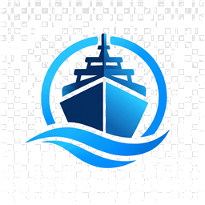
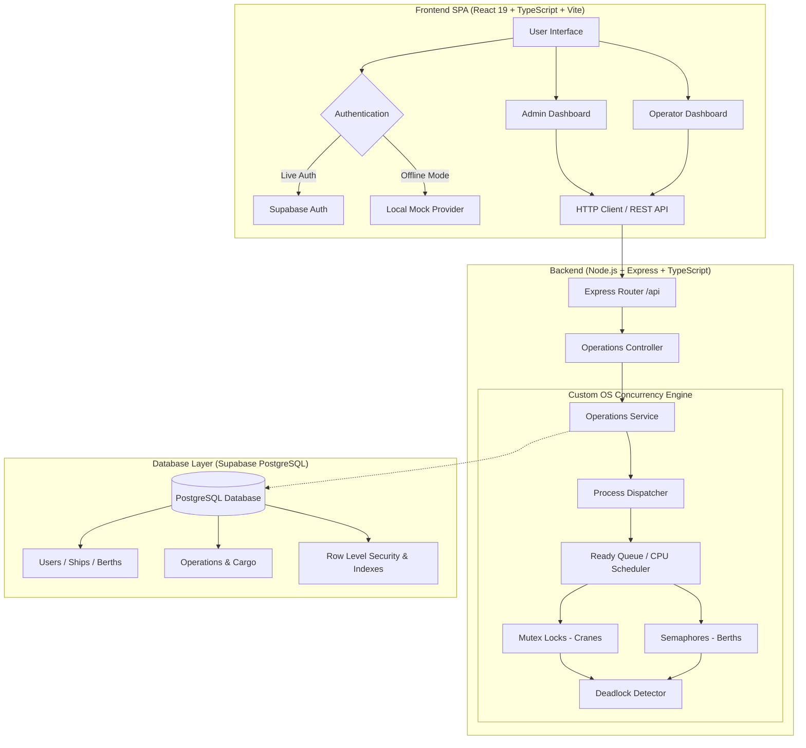

<div align="center">
  

# ⚓ PortFlow — Smart Port Management System

```text
  _____           _   ______ _               
 |  __ \         | | |  ____| |              
 | |__) |__  _ __| |_| |__  | | _____      __
 |  ___/ _ \| '__| __|  __| | |/ _ \ \ /\ / /
 | |  | (_) | |  | |_| |    | | (_) \ V  V / 
 |_|   \___/|_|   \__|_|    |_|\___/ \_/\_/  
```

**[ PHASE 2 COMPLETED: 40% PROJECT MILESTONE ]**

[](https://react.dev/)
[](https://nodejs.org/)
[](https://supabase.com/)
[](#license)

</div>

**PortFlow** is an intelligent, full-stack Maritime Port Management & Operations Terminal designed to digitize port logistics while demonstrating real-world applications of **Operating System (OS)** and **Database Management System (DBMS)** principles.

This repository reflects the **40% Project Milestone (Phase 2)**. At this stage, the core working foundation for both the **Admin Panel** and the **Operator Panel** is fully functional, seamlessly integrating advanced OS and DBMS concepts.

---

## 📑 Table of Contents

- [Overview](#-overview)
- [OS Concepts Implementation](#-os-concepts-implementation)
- [DBMS Concepts Implementation](#-dbms-concepts-implementation)
- [Architecture & Data Flow](#-architecture--data-flow)
- [Core Features](#-core-features)
- [Repository Structure](#-repository-structure)
- [Getting Started](#-getting-started)
- [Test Credentials](#-test-credentials)
- [Milestones & Roadmap](#-milestones--roadmap)

---

## 🌊 Overview

Modern ports operate around the clock, managing massive vessels, cargo, and physical infrastructure (berths and cranes). PortFlow bridges this maritime domain with computer science fundamentals:

1. **The Custom OS Kernel Simulator**: Models daily port operations as system **processes**, manages scarce crane access using **Mutex locks**, handles berth capacity using counting **Semaphores**, and schedules tasks via selectable algorithms (FCFS, SJF, Priority).
2. **The Database Engine**: Built on PostgreSQL (Supabase), providing normalized schemas, foreign-key relational integrity, B-Tree indexes, and CRUD functionality.
3. **The Web Operations Suite**: A modern React 19 SPA featuring an interactive Admin Panel and Operator Terminal.

---

## 🧠 OS Concepts Implementation

Here is exactly how Operating System concepts are implemented in the Phase 2 (40%) working phase:

| OS Concept | PortFlow Feature | How it is used in Phase 2 |
| :--- | :--- | :--- |
| **Process** | **Port Jobs / Operations** | Every job (like unloading a ship) is treated as a system process. |
| **CPU Scheduling** | **Job Scheduling** | Deciding which job goes first using selectable algorithms (**FCFS, SJF, Priority**) for active panels. |
| **Ready Queue** | **Waiting Line** | A queue for operations that are ready but waiting for equipment (Berths/Cranes). |
| **Waiting Time** | **Time Spent Waiting** | Tracking exactly how long a job sits in the waiting line before starting. |
| **Turnaround Time** | **Total Time Taken** | The total time from when the job was submitted until it finished. |
| **Process Synchronization** | **Sharing Equipment** | Making sure two jobs don't conflict by trying to use the same crane simultaneously (using **Mutex locks** and **Semaphores**). |
| **Deadlock Detection** | **System Safety** | Continuously inspects equipment-allocation graphs to detect circular waits and flag deadlocked tasks. |

---

## 💾 DBMS Concepts Implementation

Here is exactly how Database Management System concepts are implemented alongside the OS concepts:

| DBMS Concept | PortFlow Feature | How it is used in Phase 2 |
| :--- | :--- | :--- |
| **Tables** | **Port Data** | Storing structured data like Users, Ships, Berths, and Cargo for the Admin Panel. |
| **Primary Key** | **Unique ID** | A unique identifier for every single record to ensure absolute precision (e.g., User ID). |
| **Foreign Key** | **Relational Links** | Safely linking an operation to a specific user, ship, or cargo item. |
| **Normalization (3NF)** | **Clean Design** | Organizing the database efficiently so data is not repeated unnecessarily. |
| **SQL (CRUD)** | **Data Management** | The `SELECT`, `INSERT`, `UPDATE`, and `DELETE` queries used by the working User and Admin panels. |
| **Aggregate Functions**| **Reports & Analytics** | Performing math like `COUNT` or `SUM` to visualize total cargo, active operations, and user stats. |
| **Transactions** | **Safe Saves** | Ensuring a complex save (like locking an OS resource AND updating the DB) either completely works or safely rolls back. |

---

## 🏗 Architecture & Data Flow


```mermaid
flowchart TD
    subgraph Client["Frontend SPA (React 19 + TypeScript + Vite)"]
        A[User Interface] --> B{Authentication}
        B -- Live Auth --> C[Supabase Auth]
        B -- Offline Mode --> D[Local Mock Provider]
        A --> E[Admin Dashboard]
        A --> F[Operator Dashboard]
        E & F --> G[HTTP Client / REST API]
    end

    subgraph Server["Backend (Node.js + Express + TypeScript)"]
        G --> H[Express Router /api]
        H --> I[Operations Controller]
        I --> J[Operations Service]
        
        subgraph OS_Kernel["Custom OS Concurrency Engine"]
            J --> K[Process Dispatcher]
            K --> L[Ready Queue / CPU Scheduler]
            L --> M[Mutex Locks - Cranes]
            L --> N[Semaphores - Berths]
            M & N --> O[Deadlock Detector]
        end
    end

    subgraph Storage["Database Layer (Supabase PostgreSQL)"]
        J -.-> P[(PostgreSQL Database)]
        P --> Q[Users / Ships / Berths]
        P --> R[Operations & Cargo]
        P --> S[Row Level Security & Indexes]
    end
```

---

## ✨ Core Features

### 👑 Admin (The Port Manager)
The Admin controls everything from a bird's-eye view. They do not do the physical work, but they manage the entire system:
- **Dashboard**: See a quick overview of total ships, cargo, and active port operations.
- **Manage Operations**: Create tasks (like unloading a ship) and assign them to workers.
- **Manage Ships & Cargo**: Keep a record of all incoming ships and the goods they are carrying.
- **Manage Equipment**: Control the parking areas (Berths) and loading machines (Cranes).
- **Scheduling**: Choose the mathematical rule (FCFS, SJF, Priority) for how waiting tasks should be ordered.
- **Reports**: Look at detailed system logs, database stats, and port performance.

### 👷 User / Operator (The Ground Worker)
The User (or Operator) is the person on the ground actually doing the job. They only see what is relevant to them:
- **Dashboard**: See their personal work statistics and current tasks.
- **My Operations**: Receive tasks assigned by the Admin. They click "Start" when they begin moving cargo, and "Complete" when they finish.
- **Update Cargo**: Mark specific goods as successfully loaded or unloaded.
- **Report Issue**: Quickly notify the Admin if a machine breaks down or there is a delay.

---

## 📂 Repository Structure

```text
portflow/
├── README.md                      # Comprehensive project documentation
├── folder/                        
│   ├── PHASE_1.md                 # Phase 1: 10% Foundation Milestone
│   ├── PHASE_2.md                 # Phase 2: 40% Core Working Implementation
│   └── PHASE_3.md                 # Phase 3: 50% Advanced Deployment Roadmap
├── backend/                       # Node.js + Express + TypeScript Backend
│   ├── src/os/                    # Custom OS Simulation Kernel (Mutex, Scheduling)
│   └── supabase/schema.sql        # Complete PostgreSQL DDL & DB Schema
└── frontend/                      # React 19 + TypeScript + Vite SPA
    ├── src/pages/                 # Admin & Operator Dashboards (UI)
    └── src/auth/                  # Role-Based Access Control (RBAC)
```

---

## 🚀 Getting Started

### Prerequisites

- **Node.js**: v18.0.0 or higher
- **npm**: v9.0.0 or higher
- **Git**

### 1. Backend Setup

```bash
cd backend
npm install
npm run dev
```

### 2. Frontend Setup

In a new terminal window:

```bash
cd frontend
npm install
npm run dev
```

---

## 🔑 Test Credentials

PortFlow comes with pre-configured developer accounts for instant testing:

| Role | Email Address | Password | Permissions |
| :--- | :--- | :--- | :--- |
| **Port Administrator** | `admin@portflow.com` | `Password123!` | Full control, OS monitor, CRUD operations, equipment configuration |
| **Crane Operator** | `operator@portflow.com` | `Password123!` | Operational dispatch, queue monitoring, cargo status updates |

*(Note: The system ships with a clean database. Test data must be created by the user.)*

---

## 📈 Milestones & Roadmap

- [x] **Phase 1: Project Foundation (10%)** — System documentation, architectural mapping, and entity relationship modeling.
- [x] **Phase 2: Core Working Implementation (40%)** — Working Admin and Operator panels, OS scheduling, Mutex synchronization, and CRUD API.
- [ ] **Phase 3: Advanced Logistics & Production Deployment (50%)** — Customs clearance, cargo yard optimization, billing engine, and cloud hosting.

---

## 📄 License

This project is licensed under the [ISC License](LICENSE).
