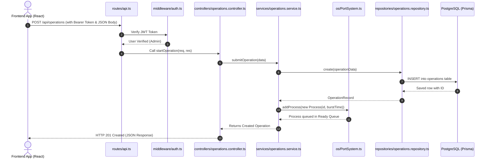

# ⚓ PortFlow Backend — Beginner-Friendly Architecture & Codebase Guide

Welcome to the **PortFlow Backend**! This server powers the entire PortFlow Smart Maritime Port Management System. It handles data persistence, user authentication, and runs a custom **Operating System (OS) Concurrency Simulator** (managing cranes via Mutex locks, berths via Semaphores, and process scheduling).

---

## 📌 1. What Does the Backend Do? (Backend vs. Frontend Responsibilities)

In simple terms:
- **Backend Responsibility**: Stores and fetches data safely from the PostgreSQL database, validates business rules (e.g., ship capacity, weight limits), verifies passwords, generates secure JWT tokens, and simulates OS scheduling algorithms.
- **Frontend Responsibility**: Displays the visual web pages (buttons, tables, cards, forms), listens to user clicks, and sends HTTP requests to this backend.

---

## 📂 2. Complete Backend Folder Structure

Here is the exact file tree of everything inside the `backend/` directory:

```text
backend/
├── .env                           # Secret environment variables (database URL, JWT secret)
├── .env.example                   # Example template showing required environment variables
├── index.js                       # Production entrypoint ('node index.js' for Render)
├── jest.config.js                 # Configuration for Jest automated test runner
├── nodemon.json                   # Configuration for nodemon dev watcher
├── package.json                   # Project metadata, scripts, and npm dependencies
├── package-lock.json              # Exact installed versions of dependencies
├── README.md                      # This comprehensive backend guide
├── tsconfig.json                  # TypeScript compiler settings for backend
├── prisma/                        # Database ORM schema
│   └── schema.prisma              # Prisma data schema (maps models to database tables)
├── supabase/                      # Raw SQL database migrations and schema definitions
│   └── schema.sql                 # SQL script defining tables, foreign keys, and indexes
└── src/                           # TypeScript source code
    ├── index.ts                   # Main server entrypoint (starts Express app on port 10000)
    ├── config/                    # Database and client connections
    │   ├── database.ts            # Raw PostgreSQL connection pool setup
    │   └── prisma.ts              # Singleton Prisma client instance
    ├── controllers/               # HTTP Request & Response handlers (Transport Layer)
    │   ├── auth.controller.ts     # Handles login, registration, and user profile requests
    │   ├── cargo.controller.ts    # Handles CRUD requests for containers/cargo
    │   ├── equipment.controller.ts# Handles CRUD requests for cranes and berths
    │   ├── operations.controller.ts# Handles job dispatching, OS state, and operations
    │   ├── ships.controller.ts    # Handles CRUD requests for docking vessels
    │   ├── system.controller.ts   # Handles audit logs, system telemetry, and bug reports
    │   └── trash.controller.ts    # Handles unified soft-delete trash bin and restoration
    ├── interfaces/                # TypeScript interface contracts (Inversion of Control)
    │   ├── index.ts               # Barrel export for all interfaces
    │   ├── repositories.interface.ts # Contracts for all data repository classes
    │   └── services.interface.ts  # Contracts for all domain business services
    ├── middleware/                # Express middleware functions
    │   └── auth.ts                # Verifies JWT bearer tokens and checks user roles
    ├── models/                    # Data models, types, and Data Transfer Objects (DTOs)
    │   ├── index.ts               # Barrel export for all data models
    │   ├── cargo.model.ts         # Types and DTOs for cargo containers
    │   ├── equipment.model.ts     # Types and DTOs for port machinery
    │   ├── operation.model.ts     # Types and DTOs for port operations & metrics
    │   ├── ship.model.ts          # Types and DTOs for ships and vessels
    │   ├── trash.model.ts         # Types for soft-deleted trash records
    │   └── user.model.ts          # Types and DTOs for users and authentication
    ├── os/                        # Custom OS Concurrency & Scheduling Simulation Kernel
    │   ├── DeadlockDetector.ts    # Inspects resource allocation graphs to find deadlocks
    │   ├── Mutex.ts               # Mutual Exclusion lock for single-use equipment (Cranes)
    │   ├── PortSystem.ts          # Central singleton OS engine coordinating processes
    │   ├── Process.ts             # Process Control Block (PCB) model for each port job
    │   ├── Scheduler.ts           # CPU Scheduling algorithms (FCFS, SJF, Priority)
    │   ├── Semaphore.ts           # Counting Semaphore for shared capacity (Berths)
    │   └── __tests__/             # Unit tests for OS simulation
    │       └── PortSystem.test.ts # Automated test verifying OS process execution
    ├── repositories/              # Data Access Layer (queries database directly)
    │   ├── cargo.repository.ts    # Database queries for cargo table
    │   ├── equipment.repository.ts# Database queries for equipment table
    │   ├── operations.repository.ts# Database queries for operations table
    │   ├── ships.repository.ts    # Database queries for ships table
    │   ├── trash.repository.ts    # Database queries for soft-deleted items
    │   └── user.repository.ts     # Database queries for users table
    ├── routes/                    # API Route endpoints mapping URLs to controllers
    │   └── api.ts                 # Express Router defining all /api/* HTTP routes
    ├── services/                  # Business Logic Layer (validates and coordinates)
    │   ├── index.ts               # Barrel export for all services
    │   ├── auth.service.ts        # Business logic for password hashing and tokens
    │   ├── cargo.service.ts       # Business logic for container validation
    │   ├── equipment.service.ts   # Business logic and dynamic OS crane/berth sync
    │   ├── operations.service.ts  # Job scheduling, waiting time math, and OS dispatch
    │   ├── ships.service.ts       # Business logic for vessel registration & IMO checks
    │   └── trash.service.ts       # Business logic for restoring and purging items
    └── store/                     # Optional placeholder directory for future memory caches
```

---

## 🔍 3. Purpose of Every Folder & File in Simple English

### Root Configuration Files

| File Name | What It Does (In Simple Terms) |
| :--- | :--- |
| `.env` | Stores sensitive secrets like `DATABASE_URL` and `JWT_SECRET`. Kept private and ignored by git. |
| `.env.example` | A safe sample file showing what settings need to be in `.env`. |
| `package.json` | Lists the libraries the backend uses (Express, Prisma, bcrypt, jsonwebtoken, etc.) and run scripts. |
| `package-lock.json` | Keeps track of the exact library versions downloaded from npm so builds are consistent. |
| `tsconfig.json` | Configures TypeScript rules (like strict mode and compile targets). |
| `index.js` | Production entrypoint (`node index.js`) used by Render to launch compiled output. |
| `nodemon.json` | Configures nodemon development auto-restart behavior for TypeScript files. |
| `jest.config.js` | Configures Jest to run unit tests in `src/os/__tests__/`. |
| `test_workflow.js` | A test script you can run (`node test_workflow.js`) to quickly test your API routes. |

---

### Database Configurations (`prisma/` & `supabase/`)

| Folder / File | What It Does |
| :--- | :--- |
| `prisma/schema.prisma` | The database blueprint. Defines models (`User`, `Ship`, `Cargo`, `Operation`, `Equipment`) and maps them to tables. |
| `supabase/schema.sql` | The raw PostgreSQL SQL script that sets up tables, primary keys, and indexes directly on Supabase. |

---

### Source Code (`src/`)

#### 1. Core Server & Config
- **`src/index.ts`**: The main brain of the backend. Starts Express, enables CORS, connects JSON parsing, registers `/api` routes, and starts listening on port 10000.
- **`src/config/database.ts`**: Connects directly to PostgreSQL using connection pooling (`pg.Pool`).
- **`src/config/prisma.ts`**: Creates a single reusable `PrismaClient` connection instance (Singleton pattern).

#### 2. Models & Interfaces (`src/models/` & `src/interfaces/`)
- **`src/models/`**: Clean TypeScript definitions of data structures. Contains records (what the DB gives us) and DTOs (what the frontend sends us when creating or updating data).
- **`src/interfaces/`**: Contracts that define what functions a Repository or Service **must** have. This allows easy unit testing and loose coupling.

#### 3. Data Flow: Routes, Controllers, Services & Repositories

| Layer & Directory | Purpose | Example |
| :--- | :--- | :--- |
| **`src/routes/api.ts`** | Defines URLs (endpoints) like `GET /api/ships` or `POST /api/operations` and links them to controllers. | `apiRouter.get('/ships', getShips)` |
| **`src/middleware/auth.ts`** | Checks if the incoming request has a valid login token (`Bearer token`). Rejects unauthorized users with HTTP 401. | `requireAuth`, `requireRole(['Admin'])` |
| **`src/controllers/`** | The "receptionist". Reads request bodies and URL parameters, calls the right Service, and sends back HTTP 200, 201, 400, or 500 status codes. | `ships.controller.ts`, `operations.controller.ts` |
| **`src/services/`** | The "brains" (Business Logic). Checks rules (e.g. ship name cannot be blank), calculates waiting/turnaround times, and interacts with the OS simulator. | `operations.service.ts`, `ships.service.ts` |
| **`src/repositories/`** | The "librarian" (Data Access). Talks directly to Prisma/database to perform `SELECT`, `INSERT`, `UPDATE`, and soft `DELETE`. | `ships.repository.ts`, `operations.repository.ts` |

#### 4. OS Simulation Kernel (`src/os/`)
This is where real Computer Science Operating System concepts come to life:
- **`Process.ts`**: Represents a port task (like unloading a ship) as an OS Process with ID, burst time, arrival time, and priority.
- **`Scheduler.ts`**: Orders tasks in the ready queue using mathematical algorithms:
  - **FCFS** (First-Come, First-Served)
  - **SJF** (Shortest Job First)
  - **Priority** (Highest priority executes first)
- **`Mutex.ts`**: Locks a crane so only **one** process can use it at a time (Mutual Exclusion).
- **`Semaphore.ts`**: Manages counting capacity for berths (parking bays) so only a fixed number of ships can dock simultaneously.
- **`DeadlockDetector.ts`**: Inspects who holds which lock to detect circular waits and prevent system freezing.
- **`PortSystem.ts`**: The central Singleton engine that puts everything together.

---

## 🔄 4. How Files Are Connected (The Request Lifecycle)

When the frontend makes an API call, data flows in a clean one-way direction:



1. **`routes/api.ts`** matches the requested URL.
2. **`middleware/auth.ts`** verifies the user's JWT login token.
3. **`controllers/`** extracts input and passes it to **`services/`**.
4. **`services/`** validates data, creates a process in **`os/`**, and calls **`repositories/`**.
5. **`repositories/`** saves the row via **Prisma** to **PostgreSQL**.
6. The response travels back up the chain to the user.

---

## 🚀 5. How to Run the Backend (Student Quickstart)

1. Open a terminal and navigate to the backend folder:
   ```bash
   cd backend
   ```
2. Install all dependencies:
   ```bash
   npm install
   ```
3. Set up your `.env` file (copy from `.env.example` and fill in your Supabase connection strings).
4. Generate the Prisma database client:
   ```bash
   npx prisma generate
   ```
5. Start the backend development server (with Nodemon hot-reload):
   ```bash
   npm run dev
   ```
   *The server will start at `http://localhost:10000` and automatically reload whenever `src/` files change.*

6. Build and run in production (suitable for Render):
   ```bash
   npm run build
   npm start
   ```
   *`npm start` runs `node index.js`, which executes the production compiled output.*

7. Run OS kernel unit tests:
   ```bash
   npm test
   ```
