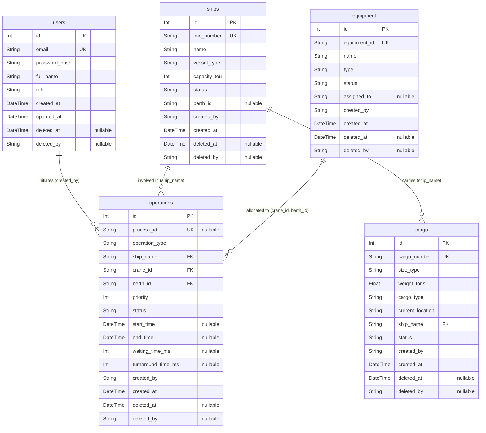
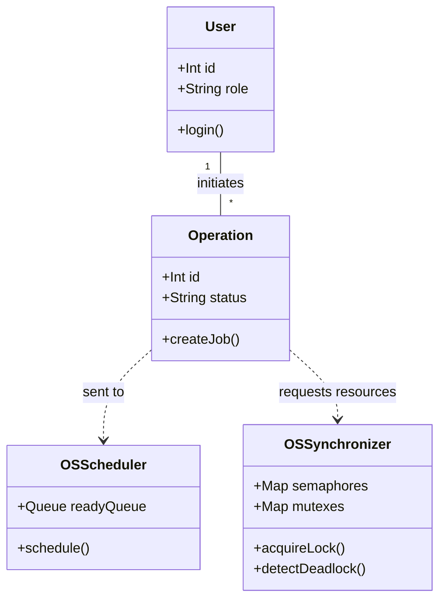

  <h1>🗺️ Phase 1: Project Blueprint</h1>
  
<strong>Foundation, Database Schema & System Architecture</strong>

---

## 🎯 1. Phase Objective
Phase 1 is the theoretical foundation of PortFlow. Before writing any code, we defined the strict boundaries of the system, mapped out the 5-table database schema, and bridged the gap between theoretical Computer Science Operating System (OS) concepts and real-world port logistics.

---

## 🗄️ 2. Database (DBMS) Planning
A port manages thousands of moving parts. To store this without data corruption, we planned a highly normalized PostgreSQL database mapping our core 5 entities.

### Entity-Relationship (ER) Diagram
This diagram shows the complete roadmap of all 5 tables planned for the final system.

### Key DBMS Rules Planned
- **Strict Foreign Keys:** A Container cannot exist without an Operation. 
- **Soft Deletes:** Records aren't destroyed; they are marked with `deleted_at` to maintain historical audit trails.

---

## ⚙️ 3. Operating System (OS) Translation
The core innovation of PortFlow is using OS simulation to route real-world port jobs. We mapped the theory to reality as follows:

| Theory (OS Concept) | Reality (PortFlow Application) | Purpose |
| :--- | :--- | :--- |
| **Process Control Block** | **Port Job Ticket** | Tracks the job's ID, priority, burst time, and state (Waiting/Running). |
| **Ready Queue** | **Job Waiting Line** | Where ships sit before they get access to a crane. |
| **CPU Scheduling** | **Job Routing Algorithm** | Determines who goes first (e.g., Shortest Job First). |
| **Mutex Lock** | **Crane Lock** | A 1:1 strict lock. Only one job can use Crane Alpha at a time. |
| **Counting Semaphore** | **Berth Limit** | If the port has 4 berths, the semaphore lets exactly 4 ships dock. |
| **Deadlock** | **Logistical Freeze** | Job A holds Crane 1 & needs Berth 2. Job B holds Berth 2 & needs Crane 1. |

---

## 🏗️ 4. Software Architecture (UML)
We designed a decoupled architecture where the React frontend talks to a Node.js API, which in turn commands the OS Simulator.

## ✅ 5. Phase 1 Deliverables
By the end of Phase 1, we successfully established:
- The full Database ER Diagram.
- The software Architecture design.
- The OS Concept mapping.
*(Note: No application code was written in Phase 1, it is purely the blueprint).*
