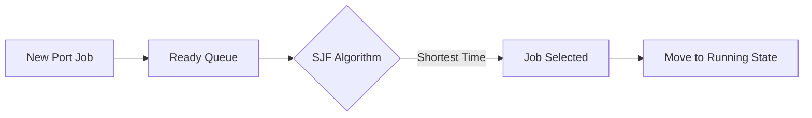
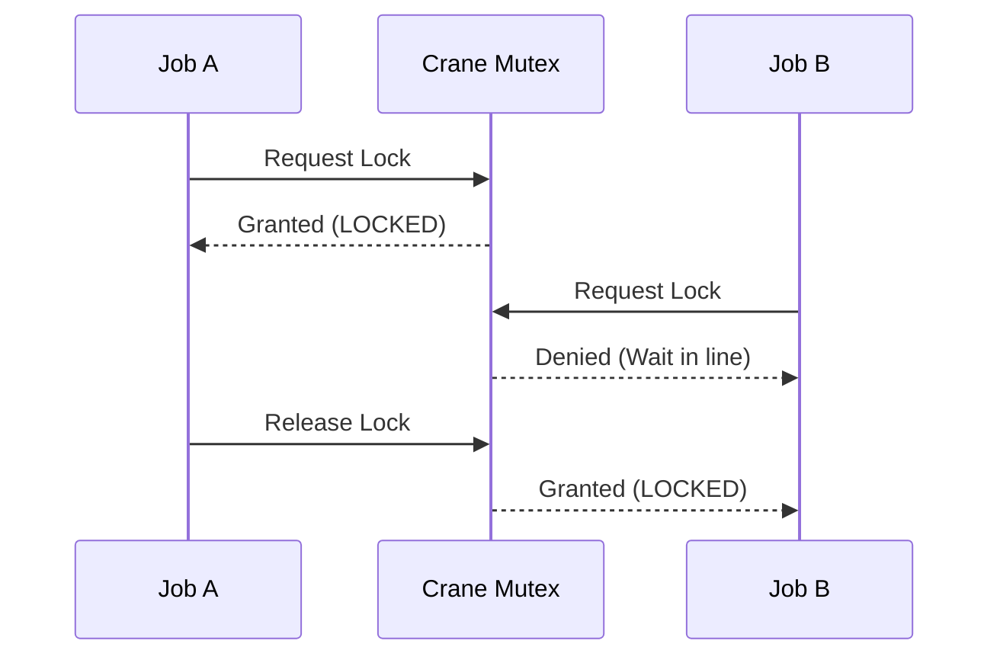

  <h1>⚙️ Phase 2: The Core Engine</h1>
  
<strong>First Working Build: Auth, Resources, and OS Simulator v1.0</strong>

---

## 🎯 1. Phase Objective
Phase 2 transforms the Phase 1 blueprint into a working software application. The goal was to build the secure backend, the frontend React UI, the basic database CRUD operations, and the first iteration of the custom OS Simulator.

*(Note: Advanced modules like Trucks, Billing, and Warehouses were explicitly excluded from this phase to keep the scope tight).*

---

## 🔐 2. Core Port Modules Built
We implemented the essential business logic required to operate the port:
1. **Authentication & RBAC:** Secure login with JWT. 
   - *Admins* have full God-mode access.
   - *Operators* can only update their assigned cargo statuses.
2. **Ships & Cargo:** CRUD interfaces to register incoming vessels and their container manifests.
3. **Physical Resources:** Admins can define how many Berths and Cranes physically exist at the port.
4. **Operations Hub:** The heart of Phase 2. Users create a Port Job (e.g., "Unload Ship X"), which is instantly handed over to the OS Simulator.

---

## 🧠 3. The OS Simulator (v1.0)
This is where the application shines. When a Port Job is created, it enters the custom Node.js OS kernel.

### A. Scheduling Engine
We built three algorithms to manage the **Ready Queue**:
- **FCFS (First Come First Serve):** Jobs run in chronological order.
- **SJF (Shortest Job First):** The system scans the queue and executes the job that will finish the fastest, minimizing average waiting time.
- **Priority Scheduling:** Admins can flag VIP cargo to jump the line.

### B. Resource Locking (Mutex & Semaphore)
Before a job can move to `RUNNING`, it must lock its resources.
- **Mutex:** Protects the Cranes. If Job A holds the Mutex for Crane 1, Job B is blocked.
- **Semaphore:** Protects Berths. A counter initialized to the number of physical berths available.

### C. Deadlock Detection (Wait-For Graph)
If two jobs get stuck waiting for each other, it causes a Deadlock. 
- In Phase 2, the system constantly runs a **Depth-First Search (DFS)** algorithm to detect cycles in the Wait-For Graph.
- If a cycle is found, it throws a giant red **Deadlock Warning** on the Admin dashboard.

---

## 🗄️ 4. DBMS Implementation
- **ACID Transactions:** Using Prisma, we guarantee that locking a crane and updating the database happen simultaneously. If the database crashes, the crane lock isn't falsely kept.
- **Soft Deletes:** Records are never fully dropped from the database; they get a `deleted_at` timestamp for audit history.
