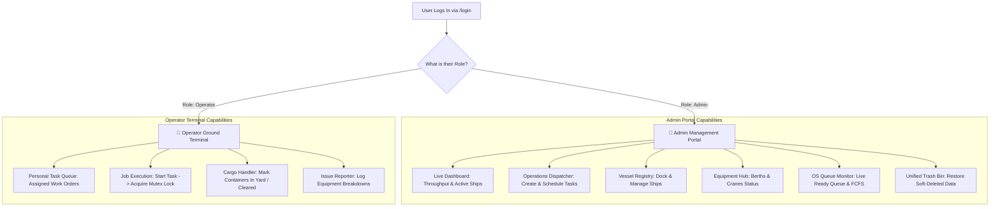

# Phase 2: Core Project Working (40% Milestone)

**Milestone Status: COMPLETED (100% of 40% Target Achieved)**

Welcome to **Phase 2** of PortFlow! While Phase 1 was our blueprint and architecture specification, **Phase 2 delivers the core, functional application**. 

In this phase, both the **Admin Management Portal** and the **Operator Ground Terminal** are fully active, interactive, and connected to our live backend and database. Most importantly, this 40% phase puts fundamental **Operating System (OS)** and **Database Management System (DBMS)** principles to work together in simple, real-world maritime scenarios.

---

## 📑 Table of Contents

1. [🌟 What Does "40% Core Working" Mean?](#-1-what-does-40-core-working-mean)
2. [👥 The Two Working Portals (Admin vs. Operator)](#-2-the-two-working-portals-admin-vs-operator)
3. [🔐 Authentication & Role-Based Login](#-3-authentication--role-based-login)
4. [🧠 Operating System (OS) Concepts Explained](#-4-operating-system-os-concepts-explained)
5. [💾 Database (DBMS) Concepts Explained](#-5-database-dbms-concepts-explained)
6. [🔄 How OS and DBMS Work Hand-in-Hand](#-6-how-os-and-dbms-work-hand-in-hand)
7. [📂 Code Map: Where the 40% Work Lives](#-7-code-map-where-the-40-work-lives)
8. [🚀 Step-by-Step Verification & Testing Guide](#-8-step-by-step-verification--testing-guide)

---

## 🌟 1. What Does "40% Core Working" Mean?

In simple English:
- **Phase 1 (10%)** was the *Plan* (Documentation, Database design, ER Diagrams).
- **Phase 2 (40%)** is the *Engine* (Working Login, Working Admin Dashboard, Working Operator Terminal, Working OS Scheduler, Working Database CRUD).
- **Phase 3 (50%)** is the *Scale* (Billing, Customs, IoT Sensors, Deployment to Cloud).

In Phase 2, you can log in, create port jobs, watch them enter an OS waiting line, watch the scheduler assign equipment using First-Come First-Served rules, observe cranes lock with Mutexes so jobs never collide, and see all changes safely saved into PostgreSQL.

---

## 👥 2. The Two Working Portals (Admin vs. Operator)

PortFlow gives each user a specialized interface tailored to their exact job:



### 1. 👑 The Admin Portal (Port Authority)
- **High-Level Visibility**: Displays total active ships, container count, equipment load, and recent activity.
- **Job Creation**: Admins create new operations (e.g. "Unload 200 containers from MV Northern Star at Berth 1 using Crane Alpha").
- **OS Control**: Switch scheduling algorithms and watch waiting times update in real-time.
- **Safety Vault**: Inspect deleted items in the Trash Bin and restore them with one click.

### 2. 👷 The Operator Terminal (Ground Operations)
- **Focused Simplicity**: Operators do not get distracted by admin financial tools. They see *only* the jobs assigned to their crane or terminal.
- **Action Buttons**: One-click to mark a task as `Running` (which acquires the crane lock) and `Completed` (which releases the lock).
- **Rapid Reporting**: Instantly notify supervisors if a crane motor overheats or a container is damaged.

---

## 🔐 3. Authentication & Role-Based Login

Security in Phase 2 guarantees that users only perform actions permitted by their role:

```text
[User Types Email/Password]
         │
         ▼
[Frontend: /login]
         │ (HTTP POST with JSON credentials)
         ▼
[Backend Auth Controller]
         │
         ├── 1. Fetches user row from PostgreSQL by email
         ├── 2. Compares password hash using bcrypt
         └── 3. Generates signed JSON Web Token (JWT) containing { userId, role }
         │
         ▼
[Frontend Auth Provider]
         │
         ├── Stores JWT token securely in browser localStorage
         └── ProtectedRoute redirects Admin to /dashboard or Operator to /operator
```

### Ready-To-Use Demo Accounts:
| Role | Email Address | Password | Permissions |
| :--- | :--- | :--- | :--- |
| **Port Administrator** | `admin@portflow.com` | `Password123!` | Full control over ships, equipment, queues, trash |
| **Crane Operator** | `operator@portflow.com` | `Password123!` | Ground terminal, task execution, cargo updates |

---

## 🧠 4. Operating System (OS) Concepts Explained

The heart of PortFlow is our **Node.js OS Simulation Engine** (`backend/src/os/`). Here is how classic computer science OS concepts solve real port problems:

| OS Concept | Real-World Analogy | How PortFlow Uses It in Phase 2 | Code Location |
| :--- | :--- | :--- | :--- |
| **Process & PCB** | A Port Work Order | Every unloading or loading task is treated as an isolated computer process with a PID (`process_id`), priority, start time, and state. | [`backend/src/os/Process.ts`](file:///c:/Users/LENOVO/Desktop/project%20folder/portflow/backend/src/os/Process.ts) |
| **Ready Queue** | The Waiting Line | When jobs are created, they enter the Ready Queue waiting for an available crane and berth. | [`backend/src/os/Scheduler.ts`](file:///c:/Users/LENOVO/Desktop/project%20folder/portflow/backend/src/os/Scheduler.ts) |
| **CPU Scheduling** | Dispatching Cranes | Deciding which job gets to run first. Phase 2 implements **FCFS (First-Come, First-Served)**: the first ship queued is the first ship serviced. | [`backend/src/os/Scheduler.ts`](file:///c:/Users/LENOVO/Desktop/project%20folder/portflow/backend/src/os/Scheduler.ts) |
| **Mutex Lock** | Crane Key | A crane can only lift one container for one ship at a time. The system acquires a Mutex lock on `crane_id`. If another job asks for that crane, it must wait. | [`backend/src/os/Mutex.ts`](file:///c:/Users/LENOVO/Desktop/project%20folder/portflow/backend/src/os/Mutex.ts) |
| **Counting Semaphore** | Berth Parking Slots | A port only has a fixed number of berths (e.g., 3 docking spots). A Semaphore with a counter of 3 lets up to 3 ships dock simultaneously. | [`backend/src/os/Semaphore.ts`](file:///c:/Users/LENOVO/Desktop/project%20folder/portflow/backend/src/os/Semaphore.ts) |
| **Waiting Time ($W_t$)** | Delay in Queue | The exact milliseconds a job spent sitting in line between its arrival time and when execution began. | [`backend/src/services/operations.service.ts`](file:///c:/Users/LENOVO/Desktop/project%20folder/portflow/backend/src/services/operations.service.ts) |
| **Turnaround Time ($T_t$)** | Total Elapsed Time | The total time from when the job was first submitted until it fully finished: $T_t = W_t + \text{Execution Time}$. | [`backend/src/services/operations.service.ts`](file:///c:/Users/LENOVO/Desktop/project%20folder/portflow/backend/src/services/operations.service.ts) |

---

## 💾 5. Database (DBMS) Concepts Explained

PortFlow stores all persistent records inside **PostgreSQL (via Prisma ORM and Supabase)**:

| DBMS Concept | Simple English Explanation | How PortFlow Uses It in Phase 2 |
| :--- | :--- | :--- |
| **Tables & Columns** | Digital filing cabinets and spreadsheets. | 5 dedicated tables: `users`, `ships`, `cargo`, `equipment`, and `operations`. |
| **Primary Key (PK)** | A guaranteed unique ID tag for every row. | Every table has an auto-incrementing integer `id` (e.g. `users.id`, `operations.id`). |
| **Foreign Keys & Relations** | Logical links connecting two tables together. | `operations` references `ship_name` and `crane_id` to establish relational integrity. |
| **3NF Normalization** | Splitting data into clean tables so nothing is repeated. | Ships are stored in `ships`, equipment in `equipment`, and tasks in `operations`. Changing a ship's name updates in exactly one place. |
| **SQL (CRUD)** | The 4 core actions: **C**reate, **R**ead, **U**pdate, **D**elete. | `INSERT` new vessels, `SELECT` active queues, `UPDATE` crane statuses, and `DELETE` old records. |
| **Aggregate Functions** | Instant math formulas across many rows. | `COUNT(*)` counts total containers, `AVG(waiting_time_ms)` computes average queue delay, and `SUM(weight_tons)` computes port tonnage. |
| **ACID Transactions** | "All-or-Nothing" safe saves. | When an operation starts, setting its status to `Running` and locking the crane to `Busy` occur inside a single atomic transaction. |
| **Soft Delete (Recycle Bin)** | Never losing data by mistake. | Instead of `DELETE FROM`, we set `deleted_at = NOW()`. The record hides from normal views but can be recovered from the Trash Bin. |
| **B-Tree Indexes** | Fast alphabetical / numerical index in the back of a book. | B-Tree indexes on `email`, `imo_number`, `status`, and `deleted_at` let the database find records in milliseconds ($O(\log N)$). |

---

## 🔄 6. How OS and DBMS Work Hand-in-Hand

In PortFlow, the OS Module and the Database are partners:

```text
       ┌────────────────────────────────────────────────────────┐
       │                 USER CLICKS "START TASK"                │
       └───────────────────────────┬────────────────────────────┘
                                   │
                                   ▼
                   ┌───────────────────────────────┐
                   │       OS Simulation Engine    │
                   │   1. Checks Crane Mutex Lock  │
                   │   2. Crane is free? Lock it!  │
                   │   3. Calculates Waiting Time  │
                   └───────────────┬───────────────┘
                                   │
                                   ▼
                   ┌───────────────────────────────┐
                   │        PostgreSQL / Prisma    │
                   │   1. Begins DB Transaction    │
                   │   2. Updates operation: 'Running'│
                   │   3. Updates crane: 'Busy'    │
                   │   4. Commits Transaction      │
                   └───────────────┬───────────────┘
                                   │
                                   ▼
       ┌────────────────────────────────────────────────────────┐
       │     SUCCESS: SCREEN UPDATES IN REAL-TIME FOR BOTH      │
       │           ADMIN PORTAL AND OPERATOR TERMINAL           │
       └────────────────────────────────────────────────────────┘
```

---

## 📂 7. Code Map: Where the 40% Work Lives

Every feature in Phase 2 maps to clean, modular code:

### Backend Structure (`backend/`)
- **OS Kernel**:
  - `src/os/Process.ts`: Process Control Block (PCB) entity definition.
  - `src/os/Mutex.ts`: Crane mutual exclusion locks.
  - `src/os/Semaphore.ts`: Berth counting semaphores.
  - `src/os/Scheduler.ts`: CPU Ready Queue and FCFS scheduling algorithm.
  - `src/os/PortSystem.ts`: Singleton managing the entire simulated port state.
- **Database Access Layer (Repositories)**:
  - `src/repositories/operations.repository.ts`: CRUD & soft-delete queries for tasks.
  - `src/repositories/ships.repository.ts`: Vessel registry queries.
  - `src/repositories/cargo.repository.ts`: Container tracking queries.
  - `src/repositories/equipment.repository.ts`: Berth and crane inventory.
  - `src/repositories/trash.repository.ts`: Global soft-delete recovery engine.
- **API Controllers & Services**:
  - `src/services/operations.service.ts`: Coordinates OS locks with database saves.
  - `src/controllers/auth.controller.ts`: Login, registration, and JWT token issuance.

### Frontend Structure (`frontend/`)
- **Pages**:
  - `src/pages/Login.tsx`: Login page with quick demo account buttons.
  - `src/pages/DashboardPage.tsx`: Admin dashboard with throughput metrics.
  - `src/pages/OperationsPage.tsx`: Operations management and FCFS dispatch.
  - `src/pages/OperatorDashboard.tsx`: Operator ground terminal.
  - `src/pages/SchedulingPage.tsx`: Interactive OS Ready Queue monitor.
  - `src/pages/TrashPage.tsx`: Unified soft-delete Recycle Bin.

---

## 🚀 8. Step-by-Step Verification & Testing Guide

You can verify the 40% Phase 2 milestone in 5 minutes:

1. **Start the System**:
   - Backend: `cd backend && npm run dev` (starts on port 10000)
   - Frontend: `cd frontend && npm run dev` (starts on port 5173)

2. **Test Login (Auth & RBAC)**:
   - Visit `http://localhost:5173/login`.
   - Click **"Demo: Port Admin"** and log in. Notice you are redirected to `/dashboard`.
   - Log out, then click **"Demo: Crane Operator"**. Notice you are redirected to the Operator view.

3. **Test OS FCFS Scheduling & Process Creation**:
   - In Admin Portal, navigate to **Operations**.
   - Create two new operations. Notice both enter the **Queued** state with priority and arrival timestamp.
   - Click **"Auto-Dispatch (FCFS)"**. Watch the first job transition to **Running** while calculating waiting time!

4. **Test Mutex Locking**:
   - Try to start a second job that uses the exact same crane while the first is running.
   - The OS Mutex lock prevents simultaneous access, ensuring crane collision safety!

5. **Test Soft-Delete & Trash Recovery**:
   - Delete an operation or ship from the table.
   - Open **Trash Bin** (`/trash`).
   - Notice the deleted item is safely waiting with its `deleted_at` timestamp.
   - Click **"Restore"**—it instantly reappears on the active dashboard without data loss!
