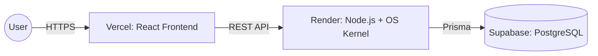

  <h1>🚀 Phase 3: Dashboard & Analytics</h1>
  
<strong>System Monitoring, Equipment Management, and Production Deployment</strong>

---

## 🎯 1. Phase Objective
Phase 3 builds upon the Core Engine from Phase 2 by adding comprehensive system monitoring, an advanced UI for port operators, and robust logging to ensure port operations run smoothly in a production environment. 

*(Note: Advanced modules like Trucks, Billing, and Warehouses, as well as Preemptive Scheduling and active RAG Deadlock Recovery, have been moved to [Future Phases](./FUTURE_PHASES.md)).*

---

## 🖥️ 2. Comprehensive Frontend Dashboards
We expanded the React UI to provide distinct experiences tailored to user roles:
1. **Admin Dashboard:** A high-level overview of port analytics, active operations, and system health.
2. **Operator Dashboard:** A focused view allowing operators to manage the specific operations and cargo assigned to them.
3. **Equipment Management:** A dedicated interface (`EquipmentPage.tsx`) to track the status, assignment, and health of Cranes and Berths.

---

## 📊 3. Advanced Analytics & Logging
To maintain visibility over the OS kernel and database, we introduced powerful observability tools:
1. **System Analytics:** New APIs (`/api/analytics`, `/api/system/db-analytics`) provide real-time metrics on process turnaround times, queue lengths, and resource utilization.
2. **System & Audit Logs:** Dedicated tracking (`LogsPage.tsx`, `ReportsPage.tsx`) for system events, ensuring full traceability of who initiated which port job and when.
3. **Issue Reporting:** A module allowing operators to report hardware malfunctions or software issues directly to administrators (`ReportIssuePage.tsx`).

---

## 🌐 4. Production Deployment
The application was fully bundled, containerized (where applicable), and deployed for live access.

## ✅ Final Conclusion
PortFlow successfully merges complex theoretical Operating System algorithms (Scheduling, Mutex, Deadlocks) with rigorous Database Management principles to create a robust, production-ready enterprise logistics platform.
