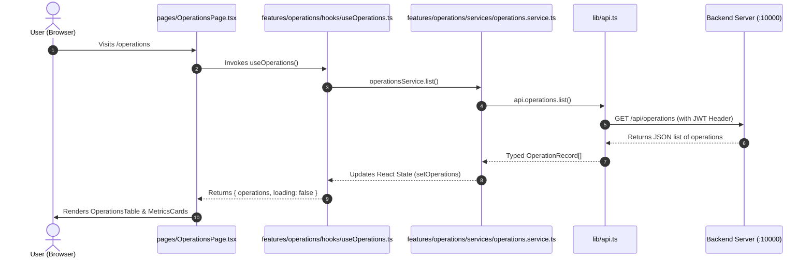

# ⚓ PortFlow Frontend — Beginner-Friendly Architecture & UI Guide

Welcome to the **PortFlow Frontend**! This is the Single Page Application (SPA) web client for the PortFlow Maritime Management System. It is built with **React 19**, **TypeScript**, **Vite**, and **Tailwind CSS**. It provides an interactive **Admin Panel** and **Operator Terminal** to monitor port infrastructure, manage vessels and cargo, and dispatch real-time operations.

---

## 📌 1. What Does the Frontend Do? (Frontend vs. Backend Responsibilities)

In simple terms:
- **Frontend Responsibility (This Project)**: Renders the visual user interface in the browser. It displays navigation bars, interactive tables, charts, status badges, and popup modals. When a user clicks a button or fills out a form, the frontend validates the inputs and sends HTTP requests to the backend server.
- **Backend Responsibility (The Other Project)**: Listens for requests from the frontend, queries PostgreSQL, manages security/passwords, and runs the OS scheduling engine.

---

## 📂 2. Complete Frontend Folder Structure

Here is the exact file tree of everything inside the `frontend/` directory:

```text
frontend/
├── .env                           # Secret frontend environment variables (VITE_API_BASE_URL)
├── .env.example                   # Example template showing required environment variables
├── .gitignore                     # Specifies files for git to ignore (e.g., node_modules, dist)
├── .oxlintrc.json                 # Linter configuration for code quality rules
├── components.json                # Configuration file for Shadcn/UI component library
├── index.html                     # Main HTML file loaded by the web browser
├── package.json                   # Lists all frontend npm libraries and run scripts
├── package-lock.json              # Exact installed versions of all frontend packages
├── postcss.config.js              # PostCSS plugins config (processes Tailwind CSS)
├── README.md                      # This comprehensive frontend guide
├── tailwind.config.js             # Tailwind CSS design system rules, themes, and animations
├── tsconfig.json                  # Root TypeScript configuration
├── tsconfig.app.json              # TypeScript compilation rules for React app files
├── tsconfig.node.json             # TypeScript compilation rules for Vite build scripts
├── vercel.json                    # Configuration for one-click deployment on Vercel
├── vite.config.ts                 # Vite bundler settings (React plugin, path aliases `@/`)
├── public/                        # Static public media served directly to the browser
│   └── image/                     # Image assets and logos
│       ├── favicon.png            # Browser tab icon
│       ├── port_sunset_bg.jpg     # Login background photographic wallpaper
│       ├── primarylogo.png        # Full PortFlow primary branding logo
│       └── secondary logo.png     # Secondary minimalist logo
└── src/                           # Source code of the React web application
    ├── App.tsx                    # Main router: sets up layout, sidebar, and page routes
    ├── hooks                      # Small utility hook detecting mobile device width
    ├── index.css                  # Global CSS styles, Tailwind imports, and design tokens
    ├── main.tsx                   # React root entrypoint (mounts React DOM into index.html)
    ├── auth/                      # Authentication & Role-Based Access Control (RBAC)
    │   ├── AuthProvider.tsx       # React Context provider managing user sessions and login
    │   └── ProtectedRoute.tsx     # Route guard blocking unauthenticated users
    ├── components/                # Reusable UI components
    │   ├── app-sidebar.tsx        # Collapsible modern application navigation sidebar
    │   ├── command-menu.tsx       # Quick keyboard command palette search (Cmd+K / Ctrl+K)
    │   ├── Sidebar.tsx            # Classic sidebar fallback component
    │   └── ui/                    # Atomic design system primitives (Radix UI / Shadcn)
    │       ├── button.tsx         # Clickable button with multiple style variants
    │       ├── card.tsx           # Container card with title, description, and content
    │       ├── command.tsx        # Popover search menu building block
    │       ├── data-table.tsx     # Reusable TanStack data table with sorting and filtering
    │       ├── dialog.tsx         # Accessible popup modal dialog primitives
    │       ├── input.tsx          # Styled form text input field
    │       ├── separator.tsx      # Visual divider line between content
    │       ├── sheet.tsx          # Slide-out drawer panel from screen edges
    │       ├── sidebar.tsx        # Compound primitives powering the app sidebar
    │       ├── skeleton.tsx       # Animated loading placeholder shimmer
    │       ├── table.tsx          # Base HTML table styling wrapper
    │       ├── tabs.tsx           # Tabbed navigation switcher component
    │       └── tooltip.tsx        # Hover tooltip popover
    ├── features/                  # Vertical Feature-Based Modules (High Scalability)
    │   └── operations/            # Port Operations & Scheduling Feature Module
    │       ├── index.ts           # Public barrel export for the operations feature
    │       ├── components/        # Presentational components for operations
    │       │   ├── OperationCreateModal.tsx # Popup modal for creating new operations
    │       │   ├── OperationEditModal.tsx   # Popup modal for editing operation status
    │       │   ├── OperationMetricsCards.tsx# KPI widgets & quick FCFS dispatch card
    │       │   └── OperationsTable.tsx      # Table displaying operations with action buttons
    │       ├── hooks/             # Custom Hook / ViewModel for operations
    │       │   └── useOperations.ts# State manager for operations list, mutations, and actions
    │       ├── services/          # Client-side API Service
    │       │   └── operations.service.ts # Dispatches HTTP requests for operations
    │       └── types/             # Feature domain models & DTOs
    │           └── operation.types.ts # TypeScript interfaces for operation records
    ├── layouts/                   # Shared wrapper layouts for page views
    ├── lib/                       # Infrastructure libraries and API client
    │   ├── api.ts                 # Unified HTTP API client (injects auth tokens, handles errors)
    │   └── supabase.ts            # Optional Supabase client initialization
    └── pages/                     # Full-page view components mapped to routes
        ├── AdminDashboard.tsx     # Shortcut route redirecting to Admin Dashboard
        ├── CargoPage.tsx          # Cargo inventory and container tracking page
        ├── DashboardPage.tsx      # Real-time analytics overview and port telemetry
        ├── EquipmentPage.tsx      # Berths and Cranes equipment management page
        ├── Login.css              # Custom styling animations for the login screen
        ├── Login.tsx              # Interactive login page with live demo credentials
        ├── LogsPage.tsx           # Audit logs and real-time system logs console
        ├── OperationsPage.tsx     # Smart Container page for port operations management
        ├── OperatorDashboard.tsx  # Shortcut route redirecting to Operator Dashboard
        ├── ReportIssuePage.tsx    # Maintenance and breakdown reporting page
        ├── ReportsPage.tsx        # High-level operational statistics and summary charts
        ├── SchedulingPage.tsx     # OS Ready Queue & algorithm switcher (FCFS/SJF/Priority)
        ├── ShipsPage.tsx          # Vessel registry and docking management page
        └── TrashPage.tsx          # Unified trash bin for restoring soft-deleted records
```

---

## 🔍 3. Purpose of Every Folder & File in Simple English

### Root Configuration Files

| File Name | What It Does (In Simple Terms) |
| :--- | :--- |
| `.env` | Stores local frontend settings like `VITE_API_BASE_URL=http://localhost:10000/api`. |
| `.env.example` | Safe template showing what environment variables are needed. |
| `index.html` | The single HTML page loaded by the browser where React mounts inside `<div id="root">`. |
| `package.json` | Lists the libraries used (React 19, Lucide icons, TanStack Table, Tailwind) and scripts (`dev`, `build`). |
| `vite.config.ts` | Configures the lightning-fast Vite build tool and defines `@/` as a shortcut for `src/`. |
| `tailwind.config.js` | Configures colors (dark mode, primary blue, emerald status colors), fonts, and rounded borders. |
| `postcss.config.js` | Helper that compiles Tailwind CSS utility classes into standard CSS. |
| `tsconfig.app.json` | Configures TypeScript checking for our React components. |
| `vercel.json` | Configures clean URL routing so page refreshes don't give 404 errors on Vercel. |

---

### Public Assets (`public/image/`)

| File Name | Purpose |
| :--- | :--- |
| `favicon.png` | The small icon displayed on your web browser's tab. |
| `port_sunset_bg.jpg`| Beautiful photo background used on the Login screen. |
| `primarylogo.png` | Main PortFlow anchor logo with text for headers and sidebars. |
| `secondary logo.png`| Secondary compact brand mark. |

---

### React Source Code (`src/`)

#### 1. Core Application Setup
- **`src/main.tsx`**: The very first file executed in the browser. Mounts React into `index.html`.
- **`src/App.tsx`**: The router headquarters. Defines which URL path shows which page (`/operations`, `/ships`, `/cargo`, `/login`, etc.) and wraps them in a sidebar layout.
- **`src/index.css`**: Global design styles, CSS variables for light/dark mode, and Tailwind styling rules.
- **`src/hooks`**: A helper function (`useIsMobile`) that checks whether the user is on a phone screen.

#### 2. Authentication (`src/auth/`)
- **`AuthProvider.tsx`**: Keeps track of who is logged in (`Admin` vs. `Operator`). Saves their login token in `localStorage` so they stay logged in when refreshing the page.
- **`ProtectedRoute.tsx`**: A security guard. If an unauthenticated user tries to visit an internal page, it redirects them to `/login`.

#### 3. Reusable UI Components (`src/components/ui/`)
These are atomic "building blocks" used across all pages:
- **`button.tsx`**: Buttons with consistent padding, hover effects, and loading states.
- **`card.tsx`**: Nice bordered containers with shadows for grouping info.
- **`data-table.tsx`**: Advanced table that supports live searching, sorting, and pagination.
- **`dialog.tsx`**: Accessible popup modal dialogs.
- **`input.tsx`**: Clean, accessible text inputs.
- **`app-sidebar.tsx`**: Collapsible sidebar menu that automatically shows admin or operator links based on user role.
- **`command-menu.tsx`**: Keyboard shortcut popup menu (`Ctrl+K`) to jump directly to any page.

#### 4. Feature-Based Architecture: Operations (`src/features/operations/`)
To keep code organized as the project grows, complex domains like **Operations** live in their own dedicated feature folder:
- **`types/operation.types.ts`**: Pure TypeScript contracts (what an Operation object looks like).
- **`services/operations.service.ts`**: Handles calling the backend API for operations.
- **`hooks/useOperations.ts`**: The "controller / brain" of the feature. Manages the list of operations, handles loading spinners, error messages, and actions (create, delete, dispatch).
- **`components/OperationsTable.tsx`**: Pure table component that displays the operations.
- **`components/OperationCreateModal.tsx`**: The popup form to create an operation with custom crane and berth selection.
- **`components/OperationEditModal.tsx`**: The popup form to change an operation's status.
- **`components/OperationMetricsCards.tsx`**: Displays active counts and the "Dispatch Next Process" button.
- **`index.ts`**: Clean export file allowing pages to import everything with `import { useOperations } from '@/features/operations'`.

#### 5. Pages (`src/pages/`)
These are the complete views shown to users:
- **`Login.tsx`**: Login page featuring easy one-click demo credentials for Admin and Operator.
- **`DashboardPage.tsx`**: High-level command center with summary statistics and active tasks.
- **`OperationsPage.tsx`**: Main operations screen (uses our clean feature-based components).
- **`ShipsPage.tsx`**: Register and manage incoming vessels and docking status.
- **`CargoPage.tsx`**: Track shipping containers, weight in tons, and warehouse locations.
- **`EquipmentPage.tsx`**: Monitor cranes and berths (ship parking slots).
- **`SchedulingPage.tsx`**: Visualizes the OS Ready Queue and lets admins change scheduling algorithms (FCFS, SJF, Priority).
- **`TrashPage.tsx`**: Unified recycle bin allowing users to restore mistakenly deleted items.
- **`LogsPage.tsx` & `ReportsPage.tsx`**: System health telemetry, audit trails, and downloadable reports.
- **`ReportIssuePage.tsx`**: Operator form to report broken cranes or berth bottlenecks.

#### 6. API Client (`src/lib/`)
- **`src/lib/api.ts`**: The central communication bridge. When any page needs data, it calls `api.operations.list()` or `api.ships.create()`. It automatically attaches your JWT login token to every request and handles network errors gracefully.

---

## 🔄 4. How Files Are Connected (The Component & State Flow)

Here is how data moves when a user interacts with the app:



1. **User opens a page** (e.g., `OperationsPage.tsx`).
2. The page uses its **Custom Hook** (`useOperations.ts`) to fetch state.
3. The hook calls the **Feature Service** (`operations.service.ts`), which uses the central **API Client** (`api.ts`).
4. `api.ts` makes an HTTP request to the Express backend.
5. When data returns, the hook updates state, and the page cleanly renders the presentational table and widgets.

---

## 🚀 5. How to Run the Frontend (Student Quickstart)

1. Open a terminal and navigate to the frontend folder:
   ```bash
   cd frontend
   ```
2. Install all dependencies:
   ```bash
   npm install
   ```
3. Make sure the backend server is running in another terminal window on port 10000.
4. Start the frontend development server:
   ```bash
   npm run dev
   ```
5. Open your browser and visit:
   ```text
   http://localhost:5173
   ```
6. Log in with the preconfigured developer accounts:
   - **Administrator**: `admin@portflow.com` / `Password123!`
   - **Crane Operator**: `operator@portflow.com` / `Password123!`
